# Caleydo Help - Data Loading and Processing

## Dataset Principles
A dataset in Caleydo is (in most cases) based on tabular data in matrix form. However, Caleydo never shows only a dataset, but always shows *perspectives* on a dataset. Perspectives are used for columns and rows of datasets separately, but you always need both, a perspective of rows and columns.

A perspective contains rules on how to access a dataset. Specifically a perspective defines:

 * The **order** of the elements (e.g., different perspectives on one dataset can contain different sortings)
 * The **containment** of elements (e.g., a perspective can represent a filter and thus only contain a subset of the data)
 * A **grouping** of elements, i.e., it's *stratification* (e.g., a clustering algorithm assigns elements to a shared group)

Attention: For example, if you'd like to filter and cluster your genes, this would create a new perspective of genes. If you would like to stratify your patients into four groups, this would create a new perspective for patients. To show your data in a heat map, you need both, the perspectives of genes and patients.

If you just load a dataset Caleydo automatically creates default perspectives containing all rows or columns for you. 

For virtually all operations in Caleydo you must specify, which dataset you want to use, which perspective you want to use for the rows in the dataset and which perspective you want to use for the columns. In many cases this might be implicit, for example, because there is only one possible combination, but sometimes you will have to specify these things yourself.

## Startup
Upon startup you can choose from different ways to start Caleydo. These are:

 * **Load Demo Data** - with readily set-up sample projects
 * **TCGA Data** - provides access to pre-packaged TCGA data files. 
 * **Load Genetic Data** - load your own files that have a reference to a common genetic identifier. You can also access a sample gene expression file.
 * **Load Other Data** - load files that do not have a genetic identifier.
 * **Load Project** - load a project you previously saved, or continue after a previous session.
 
### Load Demo Data
This is the ideal choice if you want to explore the functionality of Caleydo but don't want to bother loading your own data. You can choose from two demo projects: The TCGA project is especially suited to try out StratomeX for multi-dataset analysis, while the [CCLE](http://www.broadinstitute.org/ccle/home) project is recommended for pathway-centric analysis using enRoute.

You don't need to worry about data formats or how to load data, so you can skip to the next section.

### Load Genetic Data
Use this option if at least some of your data is molecular biology and contains a gene identifier.

When you load genetic data you need to specify the source organism of your data. Currently Caleydo supports human and mouse data. When you choose to load genetic data, pathway maps are also loaded.

Attention: You can load data from other organisms through the *Load Other Data* tab, but you won't have quite the same functionality as for these two organisms.

Attention: Note that you can't change the organism at runtime and that you can't load data from multiple organisms at a time. You can however combine *other data* with data from one organism.

To get an idea of how the import of individual datasets works, you can also choose to load a sample gene expression dataset.

### TCGA Data
We package data form [The Cancer Genome Atlas (TCGA)](http://cancergenome.nih.gov/) for Caleydo, so that you don't have to load all the TCGA datasets manually. We use the output of the Broad Institute's Firehose pipeline for all available tumor types. Firehose is run roughly every other month and you have access to the various results. 

### Load Other Data
Use this option if none of the data you want to analyze is genetic domain.

### Load Project
Here you can choose to load a Caleydo project file from your hard drive or continue where you left of when you last quit Caleydo.

##Data Format
You can load tabular data from delimited text files (or comma-separated files) into Caleydo. We refer to each of these files as one dataset. These files have to adhere to specific conventions. Asides from text files for datasets, you can also load groupings (e.g., as calculated by a clustering algorithm). Caleydo also loads pathway maps as datasets, but you can't load your own pathways.

### Dataset Conventions
 * **File Format**: Caleydo supports delimited, or comma-separated files with the file extensions .csv, .txt, and .gct.
 * **Delimiters**: Any kind of delimiter is possible. The most common delimiters are TAB and Semicolon.
 * **Identifiers**: The file must contain identifiers (headings, titles, captions) for both, rows and columns. You can choose which line and which row contains the identifiers.
 * **Columns**: The file may contain columns with data that you don't want to load. You can remove them before importing. All columns must be of equal length.
 * **Rows**: The file may contain a header, which can be ignored when loading. After the header, every row until the end must contain data.
 * **Values**: For categorical data, any value is legal. For numerical data, real values have to be provided, where the decimal symbol is period (.) not comma (,).
 0.3445 is a legal value, 0,3445 is not. Empty cells are legal and are treated as NaN (not a number). Also, if you have some other, non-numerical value in a cell of a numerical dataset, it is treated as NaN.

Here is an example of a legal table of numerical data, the identifiers are highlighted in blue:

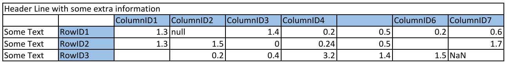

### Grouping Data Format
Groupings contain groups of identifiers. Groupings allow you to classify your data values into discrete groups. For example, a grouping into two groups of the columns of the above table would be [ColumnID1, ColumnID3] [ColumnID2, ColumnID6], containing two groups both of size two. Groupings make sense for both, columns as well as rows.

Caleydo lets you calculate groupings on the fly by using clustering algorithms at runtime. You can, however, also load external groupings. The grouping data format is very similar to the dataset format. However, it contains information on groups instead on data. In a grouping file, each grouping (you can have only one, or as many as you like in a single file) is represented in a column. A special column contains the ids of the entries you want to group. A grouping is then defined by identical strings in a column. Here is an example using the IDs of the previous example.
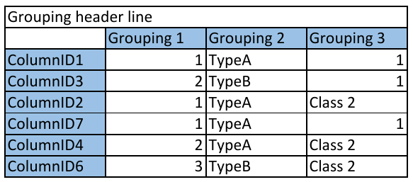

This example gives 3 groups for Grouping 1 (in this case: [ColumnID1, ColumnID2, ColumnID7] [ColumnID3, ColumnID4] [ColumnID6]), 2 groups for Grouping 2 and 2 groups for Grouping 3.

Again, this works equally for columns and rows of the dataset file. The only requirement is that the IDs between the files match.

##Data Loading
Here we discuss how datasets and groupings are loaded from the delimited text file and what options you have to process your data. A wizard guides you through the individual steps of data loading.

### Loading a Dataset
The picture on the right shows a correctly configured import dialog. The first step is to press the *Open Data File* button and select a delimited text file from your hard drive. Once you loaded the data file it will appear in the preview table. As *TAB* is selected as the default delimiter, you may have to adjust the delimiter until you see a correct table.
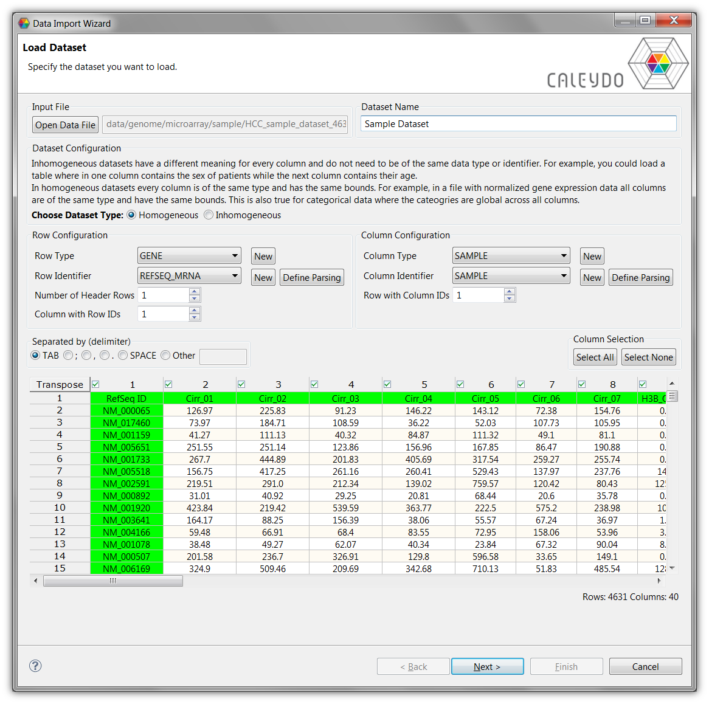

You can enter a custom dataset name or go with the one that was automatically selected.

Next, you have to choose, whether the dataset is homogeneous or inhomogeneous. A dataset is considered **homogeneous**, if all of its columns have the same *type*, *meaning*, and *bounds*. An example of a homogenous numerical dataset would be a file that only contains gene expression values with the same bounds for all columns. A file with categorical data is homogeneous, if the same categories are used in all columns. 

In contrast, an **inhomogeneous dataset** may contain both categorical and numerical columns with different categories and bounds.

Attention: Data within a column must always be homogeneous. If your rows are homogeneous instead you can swap rows and columns by clicking the *Transpose* button on the top left of the preview table.

For rows, you have to make sure that you **excluded header lines** in the file by adjusting the *Number of Header Rows* spinner if necessary.

For columns, you can **exclude individual columns** by de-selecting the checkbox at their headers.

Attention: Make sure that columns containing neither data nor IDs are deselected. 

You also have to **configure the IDs** of rows and columns. If you are loading a genetic dataset, chances are that everything is already in order, because Caleydo tries to guess the IDs in the file. The rows and columns containing the IDs are highlighted in green. The green rows and columns highlight the rows or columns where Caleydo will read IDs. If this is not correct, you have to specify where the IDs are by adjusting the *Column with Row IDs* or *Row with Column IDs* spinners.

If you do not want or need to map rows or columns to other datasets, groupings, or databases, you can select *Unmapped* in the drop-down menu for the Row or Column Type.

#### Advanced ID Mapping
Attention: This section is important if you would like to use multiple datasets in Caleydo and see their relationships.

Caleydo uses a *foreign key* principle for mapping between multiple datasets, between datasets and groupings, as well as between datasets and online databases. The following two tables are an example for the approach:

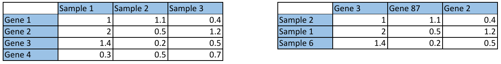

Both tables contain the same Identifiers, *Sample ID* and *Gene ID*. By telling Caleydo which identifier the file has in the columns and in the rows of the file, we can later resolve relationships between multiple datasets. In the example above, we know that the IDs of the left table's column are *samples*, while the right table uses *samples* in the rows. 

Sometimes, however, things are a little more complicated. As we often have more **complex relationships between identifiers** we need to introduce ID Types. ID Types define a family of identifiers which can be mapped among each other. In most cases you won't need to define more complex relationships by yourself, but the predefined *GENE* ID Type is an example: it contains various identifiers such as *Refseq*, *Gene Symbol*, *DAVID ID*, *Ensembl Gene ID*, etc., which can all be mapped to each other. Note, that in some cases there is no 1:1 relationship between different identifiers, which can cause one ID of dataset A to refer to multiple IDs in dataset B. In the shown diagram you can see the relationship types among the gene identifiers loaded in Caleydo.
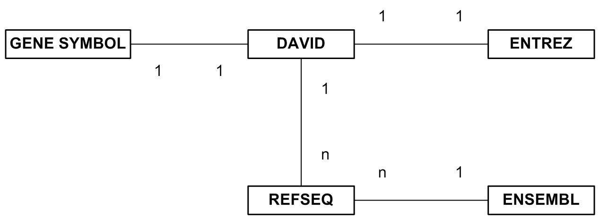

That's why you have to define both, ID Types and identifiers for rows and columns. If you have an ID Type, or and an identifier, which is not yet available in the drop-down menu, you can easily create a new one. If you later load another dataset with the same ID Type or identifier, Caleydo will be able to resolve relationships between them.

Attention: For inhomogeneous datasets you can't specify column ID types.

In some cases you might want to **map identifiers from two datasets, which are stored in a slightly different format**. For example, in one dataset the IDs could look like this: *TCGA_001-03*, whereas in another dataset the equivalent IDs use a format like that *tcga.001.03*. To make Caleydo match these different IDs, you can define how to parse row or column identifiers by pressing the *Define Parsing* button, showing the dialog on the right. First, you can choose, whether the case of the IDs should be modified, i.e., whether to keep the case unchanged, to make it upper case, or to make it lower case. Second, you can use a regular expression (see [reference](http://docs.oracle.com/javase/7/docs/api/java/util/regex/Pattern.html)) to replace all occurrences of a certain string with a different string. Third, you can specify a regular expression to split an ID around matches into several substrings and use the first substring as resulting ID. This dialog also shows a preview of all applied changes to an ID taken from the dataset.
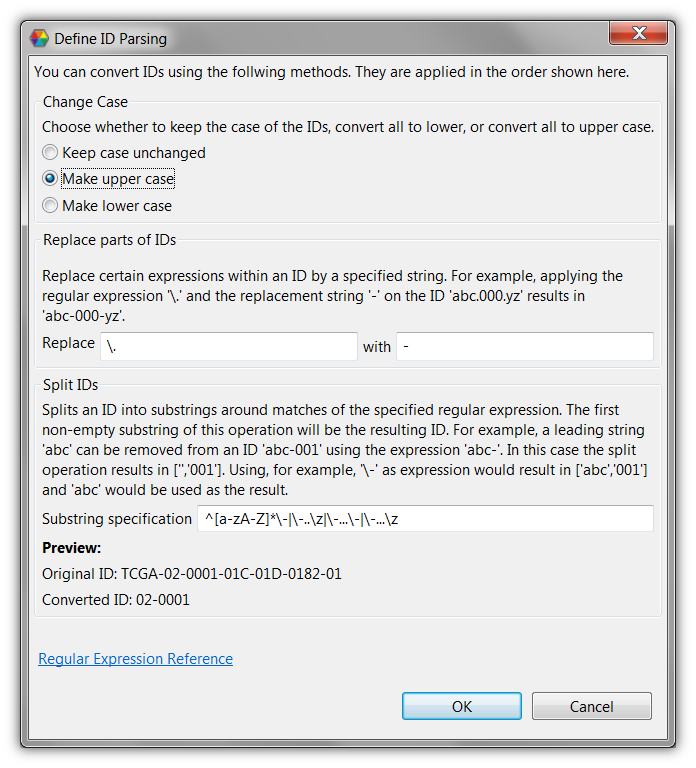

After you have adjusted all necessary settings, you can now or continue to the next wizard page.

### Specifying the Data Type for Homogeneous Datasets
If your dataset is homogeneous, you must specify whether the data is numerical or categorical on the second page, which will lead you to different subsequent pages.

### Specifying Properties for Inhomogeneous Datasets
If your dataset is inhomogeneous, you can set data properties for each column on the second page, in the dialog shown to the right. Caleydo automatically tries to determine the data type (numerical/categorical) and properties for each column. The currently set data type of a column is displayed in its header. To check or change the data type and properties of a column you can click on the *Properties* button in its header. This will open up a dialog, where you can choose whether the column contains numerical or categorical data and then set numerical and categorical data properties respectively.
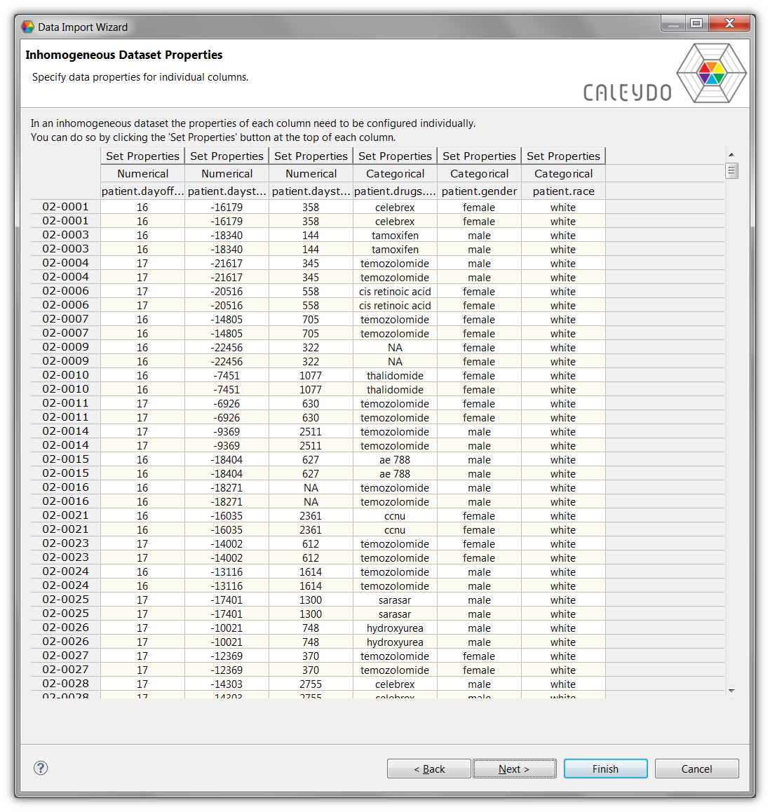

After the properties of all individual columns have been specified, you can either press *Finish* to load the datasets, or optionally load additional groupings for the dataset on the next page.

### Numerical Data Properties
Depending on whether the dataset is homogeneous or inhomogeneous, numerical data properties are either set for the whole dataset or for individual columns. The figure on the right shows the available options.
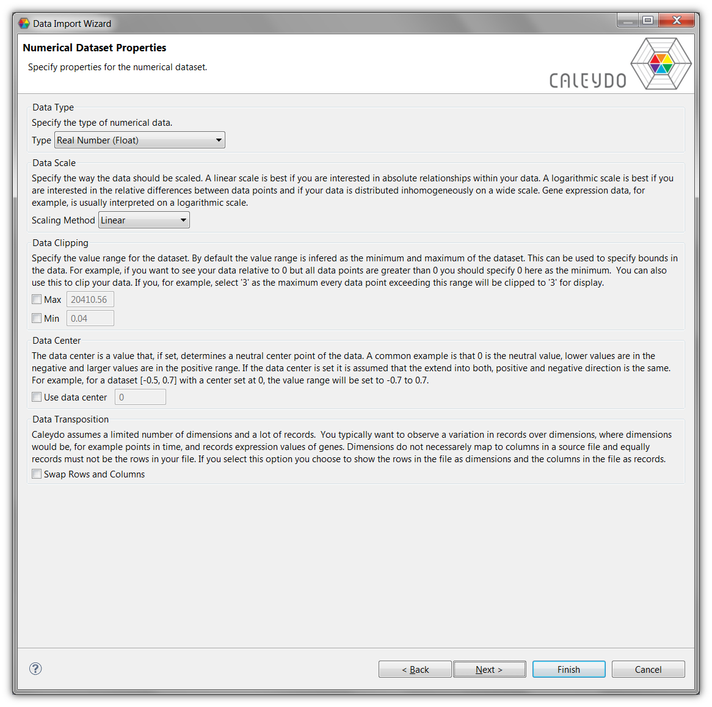

**Data Type** Choose, whether the numerical values are integers or real numbers.

**Data Scale** In some cases, it can be beneficial to use a logarithmic scale instead of a linear scale. You can choose to use a logarithmic scale for the visualizations in Caleydo by specifying one of the provides logarithms (log2 is the most common choice for gene expression data).

**Data Clipping** You can choose to clip the data at a specified maximum or minimum. This can make sense to counter-balance for outliers, which would otherwise use up much of your scale.

**Data Center** A data center can be set to define a neutral center point of the data. If set, the value range of the dataset is assumed to be equal in positive and negative direction from the center point. So, for a dataset whose values range from -0.3 to 0.5 with a data center of 0, the value range will be set to -0.5 to 0.5.

Attention: Note that Caleydo will not transform the data itself. You will always be able to retrieve the original values, but the visualizations will use the scales or transforms.
 
**Data Transposition** By default, Caleydo treats the column in the files as the *columns* in the visualizations. For example, in a parallel coordinates view, each column would correspond to an axis. If you choose to *Swap Rows and Columns* then the columns of the input file would correspond to a polyline in the parallel coordinates view.

This makes a lot of sense when you want to analyze very many columns. Also, it is common that in genetic data files, the patients or samples are stored as columns while the genes or other entities are stored in the rows. This would always leave the patients/samples in the table as the columns in the visualizations. 

Attention: As a rule of thumb, the rows in the visualizations should contain what you are primarily interested in. If you want to focus your analysis on relationships between genes and your file has the genes in the rows, don't check this. If you want to compare patients or samples across multiple datasets and your file has the samples in the columns, check this.
 
### Categorical Data Properties
Categorical data properties are also either set for the whole dataset or for individual columns.
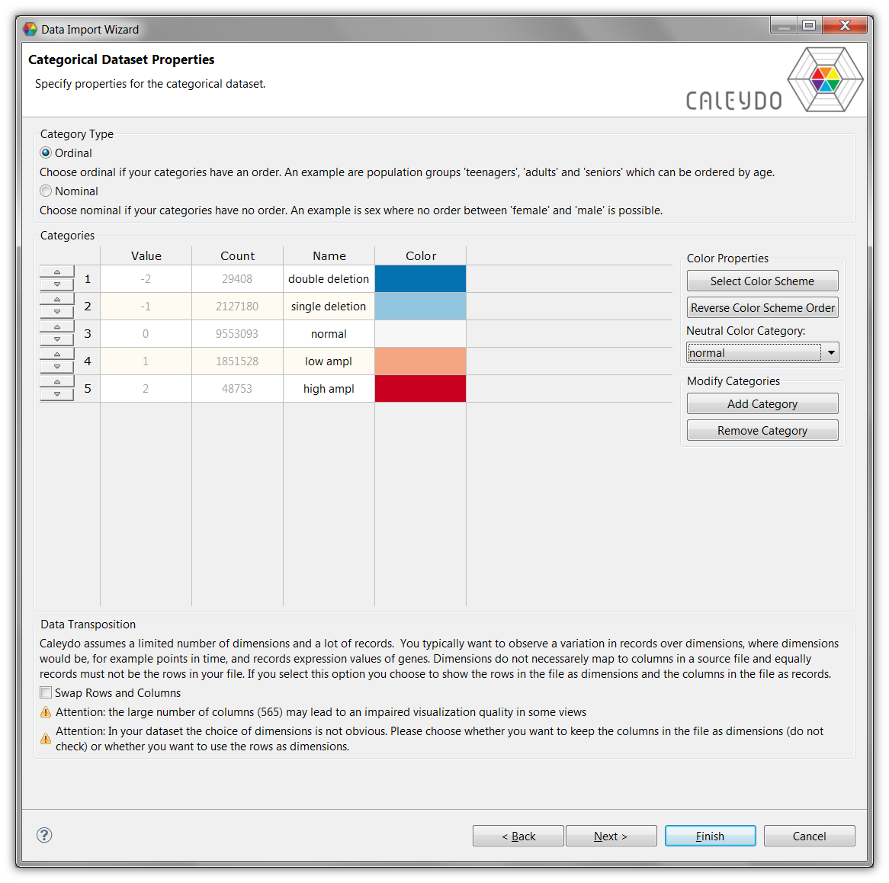

At first you have to define whether the categories are **ordinal or nominal**. Ordinal categories have an inherent order, whereas nominal categories don't. For example, the categories *child*, *adult*, and *senior* for population groups would be ordinal (sorted by their age), whereas gender with categories *male* and *female* would be nominal.

The table in this dialog shows all categories as rows that have been automatically detected by Caleydo. For each category it shows the *value* of that category as specified in the data file, the number of occurrences of that category, the name of the category (initially identical to the value), and an assigned color. The name of a category can be adjusted. You can also add new categories (to account for a category not represented in this dataset) or remove existing categories (ignoring these entries for the analysis, useful if you have empty cells) using the buttons on the right. 

If the categories are ordinal, you can change the order of categories by moving individual rows up or down using the buttons in the row header. You can define one of the categories to be *neutral* using the corresponding drop-down box on the right side. This is useful if you have values that are *higher* or *lower* than a default category. 

You can also edit the default color schemes of the categories by clicking *Select Color Scheme*. Depending on the category type, you can choose from a range of qualitative color schemes for nominal categories, sequential color schemes for ordinal categories without a neutral category, and from diverging color schemes for ordinal categories with a neutral category.  Use the *Reverse Color Scheme* button to apply the scheme's colors bottom-up instead of top-down.

If you want to specify your own color for a category, you can do so using a color dialog that appears when double clicking the category's color.

### Loading Groupings for a Dataset
As previously mentioned, you can load groupings independently for columns and for rows. For each grouping (stratification, clustering) you load, a perspective is created. Note that columns and rows here refer to the columns and rows as they are found in the preview dialog on the first page, a possible transformation is ignored.

First you will see the dialog on the left, where you can add, edit or remove groupings for rows and columns independently.

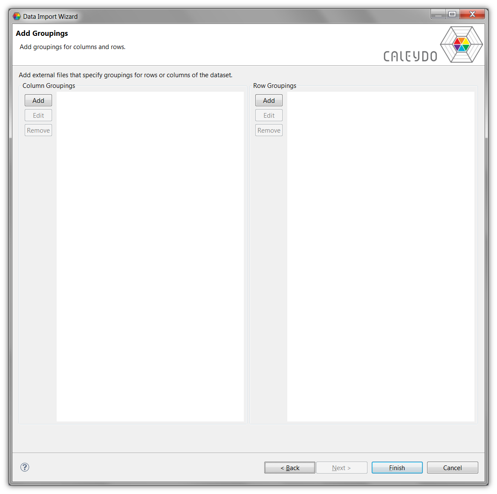
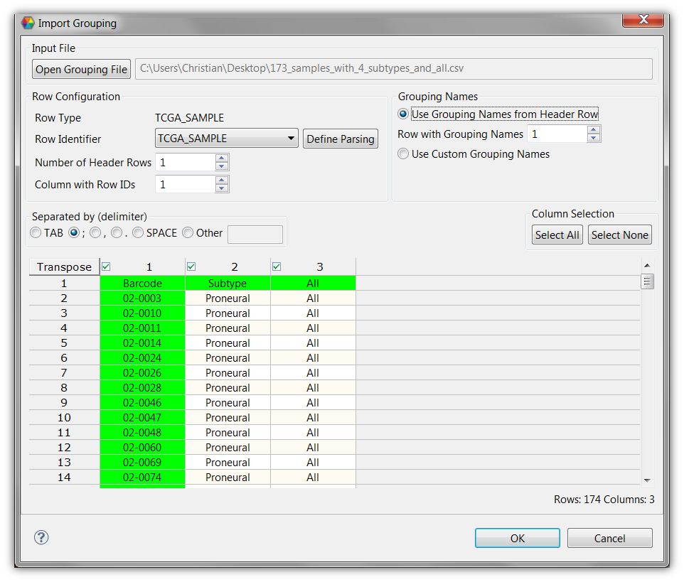

Once you click one of the *Add* buttons, you will see the dialog on the right. The dialog on the right resembles the data import dialog you have seen before. As groupings also use identifiers for their rows, you have to choose an identifier. You can't choose an ID Type, since that is already determined by your choice of columns or rows for the dataset.

Again select the *Number of Header Rows* to be excluded and identify the *Column with Row IDs*, the column that contains the IDs for the rows, which is highlighted in green.

In the example here, we have loaded a file that contains two groupings. You can choose which grouping of the file to load by checking or unchecking the columns.

You can specify a *Grouping Name* for each grouping which will later be used to name the perspective. If you choose *Use Grouping Names from Header Row*, you can specify a row within the header rows of the file, which contains the grouping names (highlighted in green). Alternatively, you can choose *Use Custom Grouping names* to directly enter the name of individual groupings within a special row of the preview table. These names will be the names of the perspectives, which you can also change later. 

Once you press finish the dataset will be loaded and Caleydo will be started.

### Adding Datasets and Groupings at runtime
You can add more datasets once Caleydo is running. To do so, go to *File > Import Data* which brings you right back to the import wizards. Alternatively, click the *Import Data Icon* in the toolbar.

To add more groupings to an existing dataset, right-click on the dataset in the Data-View Integrator and select the appropriate choice.

## File Operations
Using the *File* dialog or the equivalent buttons in the tool bar you can save Caleydo projects, import, and export data.

A **Caleydo Project** is a .cal file that contains all information about a session, including the loaded datasets, created or loaded groupings as well as which views are open and what data they show. Project files are a convenient way to store an analysis session and restore it later.

Pressing **Import Data** will bring you to the data import process you might have encountered upon startup (see [Loading Data](loading.md)). This allows you to add multiple datasets at the same time to Caleydo.

The **Export Data** button opens a dialog that allows you to save a perspective of a dataset (see [Dataset Principles](#Dataset_Principles)) to a file. This can be useful if you filtered or clustered your data in a particular way and want to process it further using other tools.

## Data Processing

### Clustering
Clustering creates a grouping of a perspective. You can trigger a clustering dialog either using *Data* - *Cluster Data* in the main or using the context menu of a data node in the [Data-View Integrator](basics.md). To run a clustering algorithm you first have to specify an input dataset, a perspective for the rows and a perspective for the columns (see [Dataset Principles](#Dataset_Principles)).
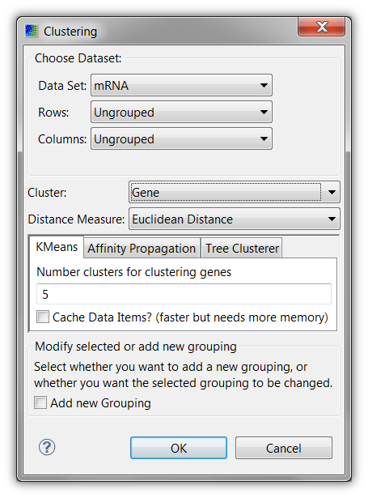

Next, you have to specify whether you want to cluster rows or columns, which are denominated by their ID type. In the shown example, *Gene* is selected.

Caleydo provides the following distance measures:

 * Euclidean distance
 * Pearson correlation
 * Manhattan distance
 * Chebyshev distance
 
You also have to choose whether you want to replace the grouping in the input perspective, or whether you want to create a new perspective with a new grouping. The latter adds an additional perspective to the dataset.

Caleydo currently supports three clustering algorithms, two of them are partitional algorithms (where no relation between the separate cluster is known) and one is a hierarchical algorithm (which builds a complete tree of relations). These algorithms are:

 * The clustering algorithm by [Eisen et al](http://dx.doi.org/10.1073/pnas.95.25.14863) (hierarchical). Here you can choose between several linkage options.
 * [Affinity propagation](http://dx.doi.org/10.1126/science.1136800) (partitional). This algorithm generally delivers the best results, but can be slow. Affinity propagation lets you choose a factor which influences the number of clusters returned, which may be between 1 and 10, where 1 produces fewer clusters and 10 produces more clusters.
 * [K-means](http://en.wikipedia.org/wiki/K-means) clustering, as implemented by WEKA (partitional). K-means is generally the fastest clustering algorithm, however you must specify the number of clusters yourself.
