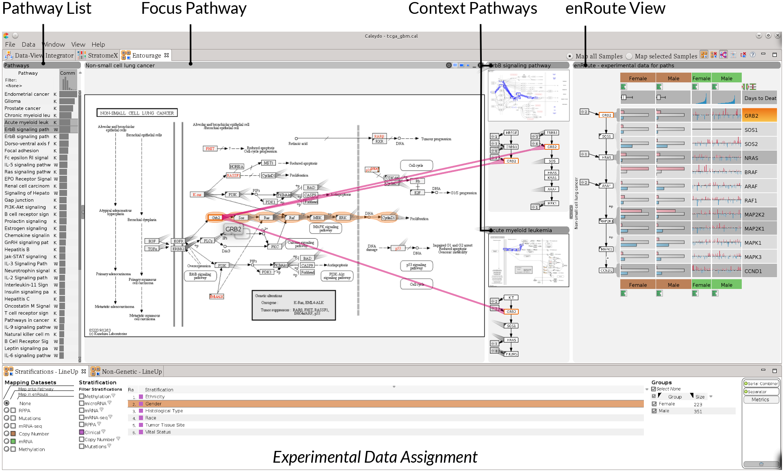
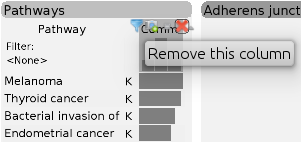
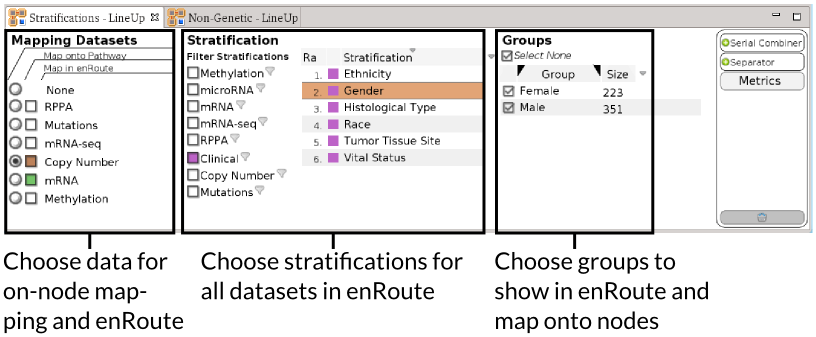

# Caleydo Help - Pathway Analysis

Caleydo's pathway analysis capabilities enable you to analyze relationships between multiple pathways and to view experimental data in the context of the a pathway. The main pathway exploration view in Caleydo is **Entourage**, which you can open through the view menu. For a general introduction to Entourage (including a video) please refer to the [Entourage project page](http://entourage.caleydo.org).

Embedded within Entourage is **enRoute**, our visualization technique for experimental data. The [enRoute project page](http://enroute.calyedo.org/), again gives you a good introduction into the view. 

Here is an example of Entourage and enRoute in a typical analysis session:

The view has several major components, the **Pathway List** on the left lets you choose pathways, the **Focus Pathway** shows a KEGG or WikiPathways pathway in full detail, and **Context Pathways** show a subset of other pathways. On the right you can see the expanded **enRoute View** that visualizes experimental data for a selected path (see orange highlight) in Focus Pathway. Finally, at the bottom you see the interface used to **assign experimental data** that is either mapped directly onto the pathway, or that is shown in enRoute. 

## Entourage - Multi Pathway Analysis

### Adding Pathways

In it's simplest form Entourage is a pathway browser. You can select pathways from the pathway list on the left. The pathway lists lets you also search for pathways by name or filter them using wildcards. You can also filter based on the pathway databases, to use only WikiPathways or KEGG. To do so click the small button (Toggle collapse / expand of this column) above the column showing Ws (WikiPathway) and Ks (KEGG). Then click the filter symbol as shown in the image on the right. 

Note: Pathways can also be added by clicking on an embedded pathway node. An example is Cell Cycle, embedded in the focus pathway shown above.

Note: You can hide and expand the Pathway List and the enRoute view using the arrows in the middle of the view's borders.

### Focus and Context Pathways

 To save space and show many pathways at the same time Entourage uses a concept called "Contextual Subsets". The figure on the left illustrates this concept for two pathways. Pathways commonly share nodes; here the nodes A and E are shared between pathways A and B - which we call portals. We always define one pathway as focus pathway, and within this pathway one node is selected as *focus node*, shown in violet here. To save space, we don't show all the details for the context pathway but only its contextual subset, i.e., the relevant part given the selection of node A in the focus pathway A. 

In the wild, this looks something like that:

Here, the Melanoma pathway is the *Focus Pathway*, The node E2F is the focus node, and the two context pathways, Glioma and Cell Cycle, show paths that also contain the focus node. The focus node is highlighted using violet stubs. 

Note: You can set a focus nodes using **Ctrl & Clicking** the node or by right-clicking on the node and choosing **Show Context** from the context menu. 

")
The **stubs** indicate **portal nodes**, i.e., nodes that connect the pathways. Stubs can be triggered by clicking the icon shown on the left. Stubs point to the portal node in the other pathways, we show one stub for every occurrence. If nodes are not visible the stubs point to and from the pathway title. Hovering over a node replaces the stubs with solid edges, as can be seen labeled **Portal Links** in the previous figure. 

 If necessary, pathways are automatically switched between multiple levels of detail. The above figure shows an example where a context pathway is shown with and one without a thumbnail of the pathway. To manually promote, demote or remove pathways you can use the buttons shown on the left, which appear as soon as you hover over a pathway title bar. The increasingly large rectangles represent the different levels of detail. The **Pin** button prevents the pathway from being automatically switched to a different level of detail. 

 You can clear all pathways from Entourage by clicking the icon shown on the left. 

### Finding related pathways

Instead of manually searching for pathways, you can ask Entourage to list and rank you all pathways that are related to another pathway, or to list and rank all pathways that contain a node. To *find a generally related pathway* right-click in the pathway or on the title bar and select "Show Related Pathways with Common Nodes". This updates the pathway list to look similar to what is shown on the left. The pathways are ranked by their similarity to the original pathway, which is defined by their node overlap, normalized by size. 

To *find pathways that contain a node* simply define a focus node, the pathway list is automatically updated. 

To *remove a filter and ranking*, simply remove the columns with the bar charts showing the similarity, using the button highlighted in the Figure above. 

## Data Assignment

Similar to [StratomeX](../stratomex/stratomex.md), Entourage and enRoute use a modified version of LineUp to choose the datasets to be analyzed. This interface is optimized for dealing with many, heterogeneous datasets and many stratifications, i.e., groupings. There are two different versions of LineUp available for choosing data for pathway analysis. The **Stratifications - LineUp** provides access to all datasets that can be mapped to genes, while the **Non-Genetic - LineUp** enables you to choose data that can not be directly mapped to a pathway. We will focus on the former for now. 

Note: You can also use the [Data-View Integrator (DVI)](../../basics.md#Data-View_Integrator) for more complex and custom data assignments.

Alert: Labels for the figures

The Stratifications LineUp has three components, Mapping Datasets, Stratifications and Groups. 

**Mapping Datasets** determined which datasets are actually mapped onto the pathway or in enRoute. You can only map one dataset at a time directly onto the pathway, Copy-Number in the example shown, but you can analyze multiple datasets at the same time in enRoute, here Copy-Number and mRNA. The datasets are identified by size. 

**Stratification** defines the grouping used for the mapping. Stratifications are often defined for datasets, e.g., using a clustering of mRNA, but we can use other parameters to stratify, such as the gender, as shown in the figure above, the copy number status of a single gene, etc.  If a stratification has additional information, such as the stratifications based on copy-number status, you can use LineUp's ranking techniques to find the best stratifications. 

Note: Since the choice of datasets is independent of the choice of groupings, it is easy to apply any grouping to any dataset! This allows you to look, e.g., at your gene expression data grouped by tumor type, etc. 

**Groups** shows you which groups are available for a stratification. In the Gender example in the figure above there are two groups: Male and Female. Using the groups menu you can choose which of them to map. 

The **non-genetic data assignment** shown on the right, lets you assign data that does not have a genetic identifier to enRoute. The example here shows numerical and categorical clinical data about patients, but you could equally use other meta-data about patients or cell lines, such as IC 50 values for drug sensitivity measurements. 

## On-Node Mapping

The nodes of pathway maps can be overlayed with a color code showing the values of related experimental data. By default no overlay is shown, but you can choose to show an overlay as explained above. You can either map all samples from the chosen source by clicking the *Map all Samples* radio button, or only samples that are currently selected (shown in the "[Selection Info View](../../basics.md#Selection_Info)") by choosing *Map selected Samples*. The color scale is shown and can be modified in the [Dataset Info View](../../basics.md#Dataset_Info). 

If more than one sample is mapped at the same time, the average value is calculated and a bar (colored with the dataset's color) below the node shows how variable the values for this node are - a long bar indicates high variance, a short bar indicates low variance.

To indicate especially variable values we use an exclamation mark inside the node. This exclamation mark is not only shown for the mapped dataset, but for all datasets mapped to enRoute.

Note: you can select elements or groups in enRoute, in StratomeX or in most other Caleydo views. 

In some cases your dataset might not have a mapping for a gene in the pathway. We indicate the absence of a mapping with a small rectangle in the lower right of the pathway node, as shown in the Figure above. Also, pathways often aggregate gene families into nodes, thus these nodes have multiple genes mapped to them. We indicate such a multi-mapping with a triangle in the upper right and display the underlying mapping genes on mouse-over and in enRoute.

## enRoute - Experimental Data Analysis

### Path Selection
In order to explore experimental data mapped to pathway nodes in more detail, a path of nodes can be extracted from the pathway view and then be shown side-by side with experimental data in the [enRoute view](enroute.md) discussed in the next chapter.

 
Before a path can be selected, the path selection mode must be enabled by clicking the corresponding button in the toolbar. This mode can be disabled any time by clicking on the button again.

To start a path click the "Toggle Path Selection" button (shown on the left) or press *Ctrl+O*. Then selecting a start node and an end node, which selects the shortest path between these nodes. This paths is highlighted with an orange bubble. If alternative paths between the specified nodes exist, they are also indicated by highlighting. Clicking on one of these highlights causes the alternative path to be selected. Note that only those paths of nodes can be selected, which are also present in the pathway.

A selected path can be extended by holding the Shift key and clicking on the node the path should be extended to. Similarly a path can be shortened by holding the Ctrl key and clicking on a node of the selected path.

 
Paths can be cleared using the corresponding button in the tool bar.

## enRoute View
The enRoute view can be used for the exploration of large amounts of experimental data that is associated with a path of pathway nodes. enRoute is essentially divided into two parts: the path visualization and the experimental data visualization.

 
In the enRoute view, every displayed element is granted enough space to be perceived well. If lots of data needs to be displayed, it can happen that horizontal scrolling is required. By selecting the corresponding button in the toolbar, the displayed content is resized to fit the width of the view.

### Path Visualization
 
On the left side of the enRoute view, the path of nodes that has been selected in the Pathway view is displayed in a top-down layout. Branches are indicated as abstract nodes that connect to the path nodes on the left side. They either summarize incoming or outgoing branches.

By clicking on the "+" icon of such a node, the individual branches are revealed by showing the first node of each branch together with an abstract preview of its mapped experimental data. When such a node is selected, all nodes of the corresponding branch up to the next branch or a dead end become part of the selected path. They either replace the existing nodes below or above the node where the branching occurs, depending on whether the selected branch is incoming or outgoing.

The currently selected path can also be modified by removing the nodes at each end. This can be achieved by hovering the mouse over the node and clicking the "x" icon that shows up.

## Experimental Data Visualization
In order to display experimental data in the enRoute view, **dataset perspectives** have to be assigned to enRoute using the [Data-View Integrator](dvi.md).
The experimental data is organized in rows and columns. Each row shows data associated with the node it is connected to. Columns represent groups of experiments, which have been specified by the dataset perspective.

Numerical data, such as gene expression data, is represented as simple bar charts, where each bar refers to one experiment. 

 

For the categorical copy number data a special encoding is used to represent the 5 categories:

 * _Deleted on one allele_: light blue bar pointing downwards
 * _Deleted on both alleles_: dark blue bar pointing downwards
 * _Normal copy number_: no bar
 * _Low amplification_: light red bar pointing upwards
 * _High amplification_: dark red bar pointing upwards

 
 

 
By clicking the button below the caption of each column, the representation of the experimental data can be switched to a more abstract form for that column. For numerical values, a single bar showing the average value of a group is used together with an error bar indicating the standard deviation. For copy number data a histogram is shown as abstract representation.
