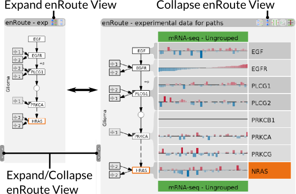
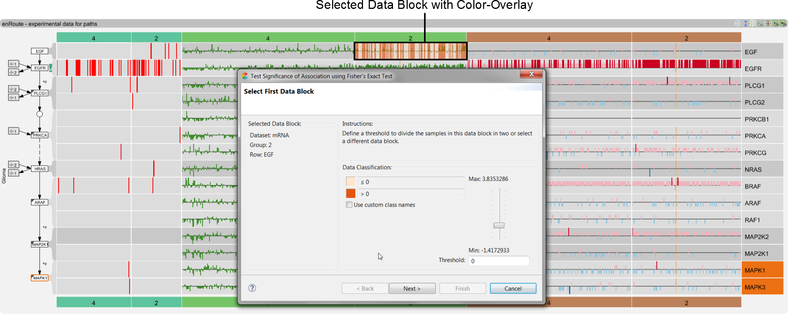
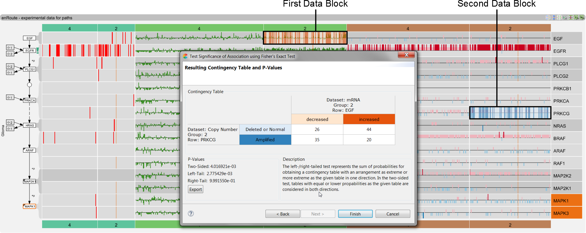

# Caleydo Help - Pathway Analysis

Caleydo's pathway analysis capabilities enable you to analyze relationships between multiple pathways and to view experimental data in the context of the pathways. The main pathway exploration view in Caleydo is **Entourage**, which you can open through the view menu. For a general introduction to Entourage (including a video) please refer to the [Entourage project page](http://entourage.caleydo.org).

Embedded within Entourage is **enRoute**, our visualization technique for experimental data. The [enRoute project page](http://enroute.calyedo.org/) again gives you a good introduction into the view. 

Here is an example of Entourage and enRoute in a typical analysis session:

The view has several major components, the **Pathway List** on the left lets you choose pathways, the **Focus Pathway** shows a KEGG or WikiPathways pathway in full detail, and **Context Pathways** show a subset of other pathways. On the right you can see the expanded **enRoute View** that visualizes experimental data for a selected path (see orange highlight) in Focus Pathway. Finally, at the bottom you see the interface used to **assign experimental data** that is either mapped directly onto the pathway, or that is shown in enRoute. 

## Entourage - Multi Pathway Analysis

### Adding Pathways

In its simplest form Entourage is a pathway browser. You can select pathways from the pathway list on the left. The pathway list lets you also search for pathways by name or filter them using wildcards. You can also filter based on the pathway databases, to include only WikiPathways or KEGG. To do so click the small button (Toggle collapse / expand of this column) above the column showing Ws (WikiPathway) and Ks (KEGG). Then click the filter symbol as shown in the image on the right. 

To find interesting pathways you can also specify a set of genes that the pathways should contain. To do so click on the button highlighted in the image on the left. This will open up a dialog which contains two lists. The left list contains all available genes, which can be searched using the input field above. To specify the set of genes that the pathways should contain, simply add genes from the left list to the right one.

When clicking OK in the dialog, the pathway list will be ranked according to the number of selected genes they contain. This number is indicated by bars shown in a separate column in the pathway list.

To *remove any filters or rankings*, simply click the button highlighted in the Figure above. 

Note: Pathways can also be added by clicking on an embedded pathway node. An example is Cell Cycle, embedded in the focus pathway shown above.

Note: You can hide and expand the Pathway List and the enRoute view using the arrows in the middle of the view's borders.

### Focus and Context Pathways

 To save space and show many pathways at the same time, Entourage uses a concept called "Contextual Subsets". The figure on the left illustrates this concept for two pathways. Pathways commonly share nodes; here the nodes A and E are shared between pathways A and B – which we call portals. We always define one pathway as focus pathway, and within this pathway one node is selected as *focus node*, shown in violet here. To save space, we don't show all the details for the context pathway but only its contextual subset, i.e., the relevant part given the selection of node A in the focus pathway A. 

In the wild, this looks something like that:

Here, the Melanoma pathway is the *Focus Pathway*, The node E2F is the focus node, and the two context pathways, Glioma and Cell Cycle, show paths that also contain the focus node. The focus node is highlighted using violet stubs. 

Note: You can set a focus nodes using **Ctrl + Clicking** the node or by right-clicking on the node and choosing **Show Context** from the context menu. 

")
The **stubs** indicate **portal nodes**, i.e., nodes that connect the pathways. Stubs can be triggered by clicking the icon shown on the left. Stubs point to the portal node in the other pathways. We show one stub for every occurrence. If nodes are not visible the stubs point to and from the pathway title. Hovering over a node replaces the stubs with solid edges, as can be seen labeled **Portal Links** in the previous figure. 

 If necessary, pathways are automatically switched between multiple levels of detail. The above figure shows an example where a context pathway is shown with and one without a thumbnail of the pathway. To manually promote, demote or remove pathways, you can use the buttons shown on the left, which appear as soon as you hover over a pathway title bar. The increasingly large rectangles represent the different levels of detail. The **Pin** button prevents the pathway from being automatically switched to a different level of detail. 

 You can clear all pathways from Entourage by clicking the icon shown on the left. 

### Finding related pathways

Instead of manually searching for pathways, you can ask Entourage to list and rank all pathways that are related to another pathway, or to list and rank all pathways that contain a node. To *find a generally related pathway* right-click in the pathway or on the title bar and select "Show Related Pathways with Common Nodes". This updates the pathway list to look similar to what is shown on the left. The pathways are ranked by their similarity to the original pathway, which is defined by their node overlap, normalized by size. 

To *find pathways that contain a node* simply define a focus node, the pathway list is automatically updated. 

## Data Assignment

Similar to [StratomeX](../stratomex/stratomex.md), Entourage and enRoute use a modified version of [LineUp](../stratomex/lineup.md) to choose the datasets to be analyzed. This interface is optimized for dealing with many, heterogeneous datasets and many stratifications, i.e., groupings. There are two different versions of LineUp available for choosing data for pathway analysis. The **Stratifications - LineUp** provides access to all datasets that can be mapped to genes, while the **Non-Genetic - LineUp** enables you to choose data that can not be directly mapped to a pathway. We will focus on the former for now. 

Note: You can also use the [Data-View Integrator (DVI)](../../basics.md#Data-View_Integrator) for more complex and custom data assignments.

The Stratifications LineUp has three components, Mapping Datasets, Stratifications and Groups. 

**Mapping Datasets** determines which datasets are actually mapped onto the pathway or in enRoute. You can only map one dataset at a time directly onto the pathway, Copy-Number in the example shown, but you can analyze multiple datasets at the same time in enRoute, here Copy-Number and mRNA. The datasets are identified by size. 

**Stratification** defines the grouping used for the mapping. Stratifications are often defined for datasets, e.g., using a clustering of mRNA, but we can use other parameters to stratify, such as the gender, as shown in the figure above, the copy number status of a single gene, etc.  If a stratification has additional information, such as the stratifications based on copy-number status, you can use LineUp's ranking techniques to find the best stratifications. 

Note: Since the choice of datasets is independent of the choice of groupings, it is easy to apply any grouping to any dataset! This allows you to look, e.g., at your gene expression data grouped by tumor type, etc.

Hint: Some stratifications, like stratifications based on mutation status, are based on genes. For these genes you can directly search for pathways that contain the genes out of lineup by using the context menu. 

**Groups** shows which groups are available for a stratification. In the Gender example in the figure above there are two groups: Male and Female. Using the groups menu you can choose which of them to map. 

The **non-genetic data assignment** shown on the right, lets you assign data that does not have a genetic identifier to enRoute. The example here shows numerical and categorical clinical data about patients, but you could equally use other meta-data about patients or cell lines, such as IC 50 values for drug sensitivity measurements. 

## On-Node Mapping

The nodes of pathway maps can be overlayed with a color showing the values of related experimental data. By default, no overlay is shown, but you can choose to show an overlay as explained above. You can either map all samples from the chosen source by clicking the *Map All Samples* radio button, or only samples that are currently selected (shown in the "[Selection Info View](../../basics.md#Selection_Info)") by choosing *Map Selected Samples*. The color scale is shown and can be modified in the [Dataset Info View](../../basics.md#Dataset_Info). 

If more than one sample is mapped at the same time, the average value is calculated and a bar (colored with the dataset's color) below the node shows how variable the values for this node are. A long bar indicates high variance, a short bar indicates low variance.

Note: If you use a z-standardized dataset, all genes are normalized to an average of 0 and a standard deviation of 1. As a result, the mapping of all nodes looks identical when you "Map All Samples". Use "Map Selected Samples" and select groups our dimensions to see the differences in the dataset. 

To indicate especially variable values we use an exclamation mark inside the node. This exclamation mark is not only shown for the mapped dataset, but for all datasets mapped to enRoute.

Note: You can select elements or groups in enRoute, in StratomeX or in most other Caleydo views. 

In some cases your dataset might not have a mapping for a gene in the pathway. We indicate the absence of a mapping with a small rectangle in the lower right of the pathway node, as shown in the Figure above. Also, pathways often aggregate gene families into single nodes, thus these nodes have multiple genes mapped to them. We indicate such a multi-mapping with a triangle in the upper right and display the underlying mapping genes on mouse-over and in enRoute.

## enRoute - Experimental Data Analysis

enRoute is a visualization technique that enables you to analyze large and heterogeneous experimental datasets in the context of pathways. 

On-node mapping of experimental data, as discussed above, is inherently limited: you can only show one or two values for each node. To address this problem, we developed the enRoute technique, illustrated on the right. Pathway maps present the topology, i.e., the structure of the network very well, but it is impossible to map many node attributes (experimental data) to it. To address this, we let users select a path in the pathway, highlighted in orange, from A to D to E on the right. This path is then extracted and shown in a linear form in the enRoute view. To the right of the extracted path we can now put experimental data from multiple groups (two groups of Dataset 1 are shown in the Figure) and multiple genetic datasets (blue and orange in the Figure). This arrangement also lends itself to integrating non-genetic data as shown in green, on top of the genetic data.

### Path Selection
In order to explore experimental data mapped to pathway nodes in more detail, a path of nodes can be extracted from the pathway view and then be shown side-by side with experimental data in the [enRoute view](enroute.md) discussed in the next chapter.

To start a path selection, click the path selection button shown on the left. Entourage stays in path-selection mode until you disable the mode by clicking the button again. 

When in path selection mode simply click a start node and hover over connected nodes to extend the selected path. You will see an orange bubble around your path, as shown on the right, and the extracted path appears on the right in the enRoute view. If alternative paths between the specified nodes exist, they are also shown in a different color, blue and red in the example on the right. Clicking on one of these highlights causes the alternative path to be selected. You can complete a path by clicking a terminal node. 
 

You can **extend a path** after it was completed, or **force a node to be included** in the path by pressing **Shift while Clicking**. The figure on the right shows an example of a "path" made up of individual nodes and its corresponding extracted path. Forcing nodes to be included can help you address problems of the underlying pathway representation or can simply let you put genes of other paths or pathways in context for an analysis. 
 

You can also **extend paths across pathway boundaries** using either regular path selection or forced paths.

 Paths can be cleared using the corresponding button in the tool bar or are replaced when a new path is selected.

### enRoute View
Once a path is selected it appears in the enRoute view on the right. To see the experimental data mapped to enRoute click either the expand button at the top right of the enRoute view, or the arrows at the left edge of the view. The arrows enable you to extend enRoute to various widths, thus adjusting the size of enRoute to the analysis requirements. 

The following figure introduces all major components of enRoute. It shows an example where a copy number (brown) and a mRNA expression (green) dataset are the genetic datasets used and the grouping is derived from the mutation status of a gene.  Additionally, three non-genetic, contextual datasets are shown: Race (categorical), Days to Death (numerical) and Gender (categorical). 

Note: To learn how to assign these datasets refer to the [Data Assignment section](pathway.md#Data_Assignment).

#### Path Representation
On the left side of the enRoute view, the path that has been selected is displayed. Incoming and outgoing branches are indicated as collapsed nodes that connect to the path nodes on the left side. The number in these collapsed nodes encodes how many nodes are contained within. Clicking on the "+" icon of such a node reveals the concrete branches. Selecting such a node **replaces the following or preceding nodes** of the branch points with the alternative branch, adding the path as long as it is not ambiguous. Nodes can also be **removed** by clicking the "x" icon that appears when hovering over a node.

#### Resolving Gene Families
Nodes in pathways often represent gene families instead of individual genes; for mapping experimental data, however, this aggregation is not suitable. Consequently enRoute resolves such multi-mappings, as shown in the above Figure. The node containing the gene family (marked by a triangle in the upper left corner) is shown in the path and is connected with multiple rows, where each row represents a gene of the family. All rows in a family also have the same shade of gray.

#### Visualizing Experimental Data
Within the rows the experimental data is visualized in groups. The header of the group contains the group name and is colored in the datasets' color. Elements within groups are always of the same datasets, but enRoute can show multiple groups from various datasets. Groups can show their **data as a summary**, which is space-efficient, or can show each **dimension individually**.

To **represent individual dimensions**, enRoute uses various visual encodings, adapted to the underlying data type:

 Bar chart with a neutral (zero) line represent numerical data that is centered (see [numerical data properties](index.html#!data.md#Numerical_Data_Properties)).

 Bar chart without a center line represent non-centered numerical data. 

 Heatmap where the color encodes categorical data. 

Note: Every bar or color field can be selected and shows the exact underlying value in a tool-tip. 

Hint: You can see the color mapping for all genes in a pathway for the selected experiments if you choose to [Map Selected Data](index.html#!pathway/pathway.md#On-Node_Mapping). 

 
enRoute tries to show all elements in the available space, i.e., to **fit to width**. However, if there are too many experiments this will result in bars disappearing since their width would be less than one pixel. You can choose to switch off fit to width using the button shown on the left. As a result you will have to scroll enRoute to see all the data. 

The more compact alternative to represent experimental is to display the **data as a summary**.

 We use a box plot to summarize numerical data (either with or without a center line). The white line in the center shows the median, the left and right edges of the box are the 1st and 3rd quartile of the distribution respectively, and the whiskers end at the highest/lowest value within 1.5 times the inter-quartile range. The precise values are shown in a tool-tip on mouse-over. 

 Categorical values are summarized in histograms that show the distribution of the categories. 

Hint: You can sort based on the values of each row by double-clicking, or by using the context menu on the row's label. The dimensions are sorted within their groups. The above figure, for example, is sorted by the values associated with *EGFR*.

**Color Mapping.** For numerical data you have the option to show the bars in a uniform color corresponding to their dataset, as shown on the left (the default), or to redundantly encode the values with the color mapping defined for the datasets as shown on the right. You can switch color mapping on by pressing the icon shown on the left, which is part of the enRoute tool-bar.  Note that for categorical datasets, color mapping is always on. 

#### Integrating Contextual Datasets

In addition to gene nodes that are part of a pathway, enRoute integrates contextual, non-genetic datasets. See the [Data Assignment section](index.html#!views/pathway/pathway.md#Data_Assignment) to learn how to add contextual data. Contextual data is shown above the genetic data, as can be seen in the figure above. Rows of contextual data are treated much like rows of genetic data, the only exception is that the dataset within a row is always the same for all groups. In the above figure, for example, two different genetic datasets are shown next to each other. The contextual data, such as "Gender", however, shows the same attributes for both datasets. To indicate this, the labels of the contextual data's rows are shown in the dataset color.

Hint: All operations that work on regular rows, such as sorting or highlighting, equally work for contextual data.

### Statistical Tests
In order to asses whether a correlation of experimental data spotted in the enRoute view is statistically significant, two statistical tests are provided. For both tests a wizard guides through a step-by-step process for assessing the significance of correlation between two selected blocks of data.

Note: The statistical tests can only be performed for two blocks of data that have at least one sample in common.

#### Fisher's Exact Test
 [Fisher's exact test](http://en.wikipedia.org/wiki/Fisher%27s_exact_test) can be used to asses the significance of association between two blocks of data, which can either be numerical or categorical. When clicking the icon shown on the left, a wizard dialog pops up. At first the two data blocks have to be selected in the enRoute view and classified individually into two groups.

In the image above a numerical data block was selected as first data block. In the dialog the samples are classified into two groups according to a threshold value that can be set using a slider or directly entered in the corresponding input field. In the enRoute view the values in the selected block are overlaid with the color of the associated group. The group of samples with values smaller than or equal to the threshold is light orange, the group with values greater than the threshold is dark orange. To change the default labelling of the groups, select the checkbox "Use custom class names" and enter the names into the groups' input fields.

The dialog on the right is shown when a categorical data block is selected. Again, the samples are classified into two groups, but this time each group represents a set of categories. The category sets are shown in two lists and each category can be moved from one set to the other using the buttons between the lists. The groups for this second data block are colored light blue and dark blue. Like in the numerical classification, the default labels can be changed by selecting the checkbox "Use custom class names" and entering the names into the groups' input fields.

After the data blocks were selected and classified, the resulting contingency table is shown in the wizard. The cells of the table display the number of samples that belong to a certain combination of groups. For example, in the image above, there are 20 samples that have an increased mRNA expression in EGF and an amplified copy number in PRKCG. To judge the significance of obtaining such a contingency table, we display the p values for the two-sided, left-, and right-tail tests below.

Hint: The results and the sample classifications can be exported as .csv file by clicking on the corresponding button.

#### Wilcoxon Rank-Sum Test
 The [Wilcoxon rank-sum test](http://en.wikipedia.org/wiki/Mann%E2%80%93Whitney_U_test) can be used to asses the significance of association between numerical blocks of data. 
