## LineUp
LineUp is visualization technique for analyzing multi-attribute rankings. If you want to find out more about this general visualization technique, take a look at the [LineUp project page](http://lineup.caleydo.org). 

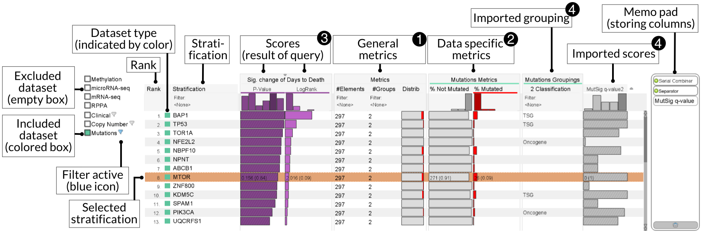

In StratomeX, LineUp is used as a selection interface for block columns. LineUp can be categorized in three parts: 

 * **Dataset selection** 
   The dataset list on the left can be used to include and exclude datasets from the ranking query. In addition, clinical and categorical datasets support simple filtering operations that can be used to filter specific categories and/or specific clinical variable data types. A context menu of the dataset items provides additional features including the loading of external grouping and scores.

 * **Ranking table** 
   The central part of the LineUp visualization technique can be used to rank, filter, browse, and select the contained dataset items in a flexible way.

 * **Memo pad** 
   The area on the right of the LineUp interface can be used to persist scores over multiple wizards instances. Please take a look at the [LineUp project page](http://lineup.caleydo.org) for details about the memo pad.
   
### Ranking table
The ranking table is the central part of LineUp. It consists of multiple columns that can be freely re-ordered using drag-and-drop. Each column provides its own menu, e.g. for filtering and searching data. The following column types are available:

 * **Rank column** showing the rank of the current item.

 * **Stratification column** showing the name and the dataset type indicated by color. The column supports simple filtering and search operations.

 * **Score column** depending on the current query, zero, one or more score query columns are shown in the ranking table for ranking the dataset items.

 * **General metric columns** 
  This group of columns presents simple statistics about an item, including the number of elements, the number of groups, and a simple group distribution visualization

 * **Data type specific metric columns** 
  For each included categorical datasets additional metric columns are displayed showing the distribution of the contained categories. In addition, dimension stratifications are automatically added as categorical grouping columns.

 * **Externally loaded score columns** 
  In addition to automatically created and computed query scores during the Tour Guide process, external scores can be imported to the LineUp interface. The import process can be triggered by using the context menu of a dataset.

### Interaction
Rows can be selected by clicking on them. LineUp also supports navigation via keyboard using up/down keys and page up/down keys and scrolling by mouse wheel. Sorting by a column can be done by double-clicking its header. The current sort criterion is indicated by a small triangle glyph above the column header. 

Hint: Adding an item to StratomeX without having an open Tour Guide wizard can be done by double-clicking the item.

Attention: If a Tour Guide wizard instance is open, previews will only be shown when the wizard is in the correct state, otherwise the selection will be ignored. 

The current selected row will be highlighted in orange. Grey rows indicate items that are already visible in StratomeX. An orange dashed border will be used within StratomeX and LineUp to indicate the currently previewed item. 

Score queries based on a parameter (e.g. find similar to a displayed stratification) are colored according the dataset color of the selected parameter, allowing simpler association.

### Dataset Actions

*(De)Activate a dataset* by *clicking* a dataset all items will be included or excluded in the current stratification ranking. A colored box in the color of the data set indicates that the dataset is currently active. 

Hint: double-clicking a dataset will activate it and deactivate all the others.

*Edit Filter*	

datasets can be filtered depending on the type. For every dataset you can specify a *Minimum set size*, which defines the minimum size as set of this dataset must have to be considered during querying. In addition, for categorical datasets you can filter the included categories used during querying. 

### General Table Actions

*Order By*	
by **double clicking** a column header the table will be sorted by the values in this column. This is indicated by a tiny triangle at the top center of the column. 

*Reorder Column*
by **dragging** a column the columns can be reordered. In addition, if the CTRL-key is hold the column will be copied instead of moved. Last but not least, if a column is dragged onto another column a parallel combiner can be created by both of them as it will be indicated in the target column header. 

*Item Selection*
Items can selected by clicking the item row. The current selected item will be highlighted in **orange**. In addition, the raw values of the row are shown for the selected item. Moreover, rows having a *grey* background represent that they are already visible in StratomeX. 

*Item Navigation*
Items can be navigated by using the **Cursor-Up** and **Cursor-Down** keys. Morever, Mouse-Wheel, Page-Up, Page-Down, Home, and End keys are supported to scroll within the table. 

*Change Item Layout*

Switches between a uniform layout (left) and a fish-eye layout (right).

*Add Serial Combiner Column*

creates a new empty serial combined column container. A serial combiner implements a weighted sum combiner. 

*Add Nested Combined Column*

creates a new empty nested combined column container. A nested combiner sorts by the first attribute and uses the remaining ones in cases, where the items are equal.  

*Add Generic JavaScript Combined Column*

creates a new empty JavaScript combined column container. A JavaScript combiner evaluates a javascript function that implements a comparator function to sort the items. 

*Add a Rank Separator*

add a rank separator at the rightmost position. A rank separator acts as a barrier between two rankings, such that the left and right side can be ranked by its own sorting criteria. Slopegraphs are used to link the items between the two rankings. 

### Column Actions
Every column provides a set of actions that can be accessed via the **hover menu** of a column header. 

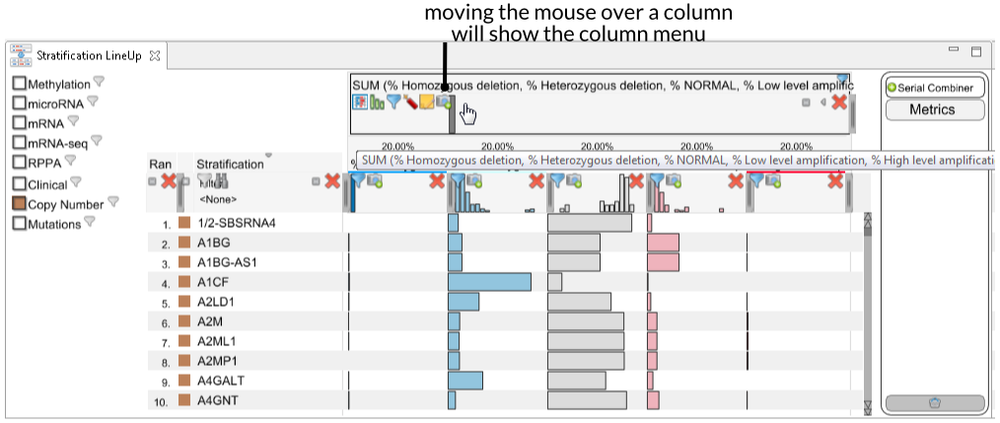
 

*Hide*

hides the column and put it into the memo-pad area at the right side.

*Search*

Opens an editor to search for a specific item.

*Edit Filter*	

opens the filter/mapping editor of this column. The icon will be blue, if a filter is currently active.

*Change Width*

Drag indicator for changing the width of a column. In the case of a column within a stuck column, this will also change the weight of the attribute

*(Un)Collapse*

collapse columns, such that they uses only a limited amount of space.

*(Un)Compress*

compress a serial combiner column, by hiding the contained colums.

*Take a snapshot*

creates a new separator and rank with a clone of the column.

*Edit Java Script Code*

opens a JavaScript editor to edit the generic combiner function.

*Explode*

Removes a combined columns and splits it into its components.

*Show/Hide Histograms*

toggles the visibility of the distribution of columns.

*Edit Notes*

opens a text editor to edit the title as well as the tooltip description of the column.

*Show/Hide Rank Deltas*

shows/hides the rank delta between the current rank column and its nearest left neighbor.

*Add a Rank Delta Column*

Add a special combiner colums, which represents the rank delta of the rankings created by the two contained columns.

*Change Serial Column Layout*

Switches between different serial column layouts, including: stacked (first - default), tabke (second), and ordered (last). The ordered layout is a special one, in which per item the attributes are sorted decreasingly by their contribution to the item's score.

*Sort By Weights*

resorts the members of a serial column decreasingly by their weight.

*Edit Weights*
Either by using the context menu or by *double clicking the weights* an editor is opened, which can be used to specify exact weights for a serial combiner.

### Mapping Editor
The mapping editor is a complex tool to manipulate the way how raw values are interpreted as attribute scores used for ranking. 

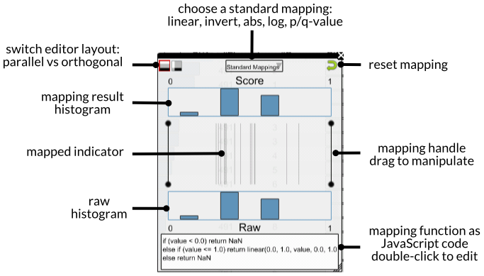

The raw values are shown at the bottom and the normalized mapping result at the top. The mapping lines in between can be moved via drag-and-drop to manipulate the ranking. 

Usage Examples: 

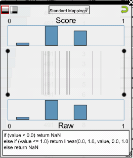
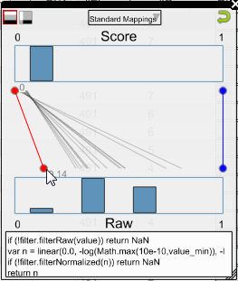
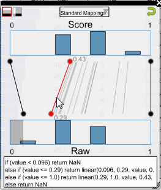
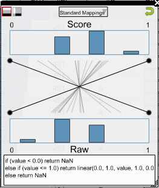
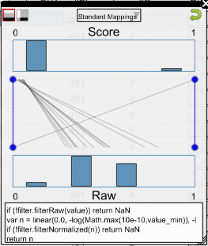
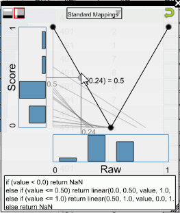

The simplest form is the linear mapping (1), in which the minimal raw value is mapped to 0 and the maximal value is mapped to 1. In the same way the mapping can be used to filter raw or normalized values, since everything outside of the mapped range, will be removed from the ranking (2). In addition, by clicking in the mapping canvas, additional mapping lines can be created (3), which can be used to create a piecewise linear mapping function. Last but not least, multiple standard mappings are available including invert (4) (the less the better), a standard p-value/q-value mapping (<code>-log(value)</code>) (5) as well as an absolute mapping (<code>abs(value)</code>) (6). The last figure shows the alternative orthogonal mapping editor, which has the normalized values orthogonal to the raw ones. 

To create complex mapping functions the integrated JavaScript editor can be used, that can be opened by double-clicking the JavaScript code, shown at the bottom. However, once editied the interactive mapping editor is reduced to filtering operations. 

Following actions are available: 

*Mapping Point States*

shows different states of the mapping editor mapping points. white means inactive, red active, blue filter only mode and dashed that the position is inferred from the data.

*Mapping Editor Mode*

switches between the Parallel Editor (left) and the Orthogonal Editor (right).

*Reset*

resets the mapping to a linear one.

### Loading External Scores

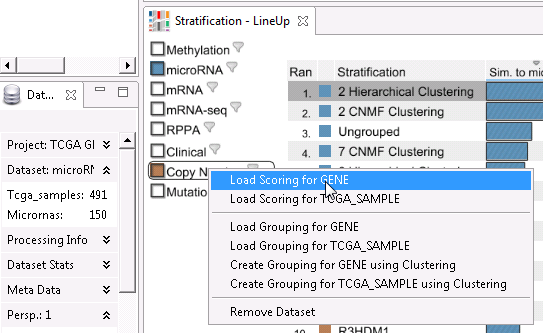
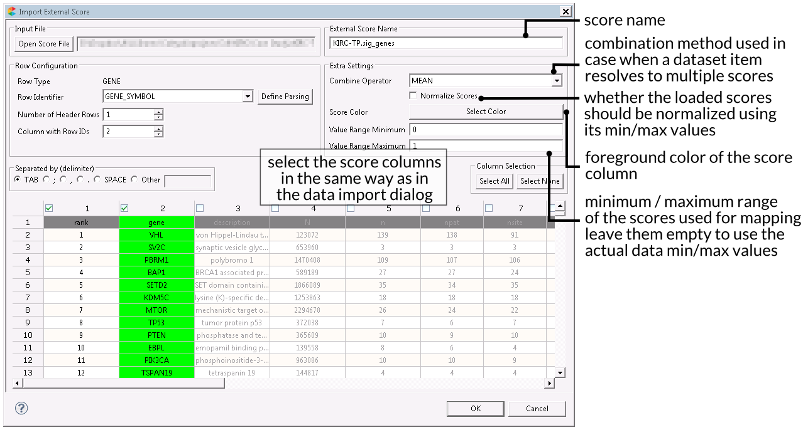

External scores can be loaded via the context menu of a dataset. Afterwards an import dialog - similar to the data import dialog - is shown in which the data file as well the the external score properties can be defined. After importing the score, a new column will appear in LineUp. 

### External Categorical Groupings

A special property of LineUp is that dimension groupings of categorical datasets (e.g. mutations) are automatically inserted as a categorical column into LineUp. For example, this can be used to load a gene cateogorization and use this information to filter the mutation data. 

*Note*: after you loaded a external categorical grouping you may need to deactivate and activate the dataset again, in order to see the loaded grouping. 