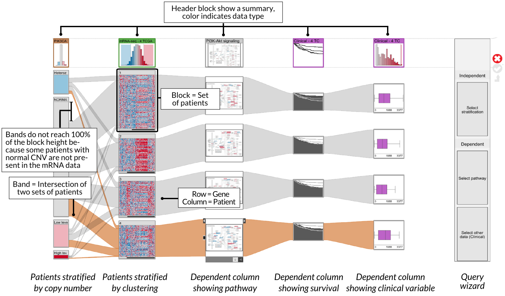

# Caleydo Help - StratomeX: Multi-Dataset Analysis

StratomeX is a visualization technique for the analysis of multiple stratified datasets. For a general introduction please refer to the [StratomeX project page](http://stratomex.caleydo.org/). 

## StratomeX Elements

### Columns
Each column in StratomeX consists of multiple data blocks from one of the datasets. The blocks that make up the column are groups or rows, or *stratifications* of the dataset. 

 * **Adding columns** 
 Columns can be either added using the [Query wizard](stratomex.md#Query_Wizard_-_Adding_Data), [LineUp](stratomex.md#LineUp), or the [Data-View Integrator](../../basics.md#Data-View_Integrator).
 * **Removing columns** 
 Columns can be removed by either using the close icon that is appears when hovering over the header block or by selecting the corresponding option in the right-click context menu of the header block.
 * **Reordering columns** 
 Columns inside StratomeX can be reordered by using drag-and-drop. Pick the header block, hold the mouse button, move the column to the new position and release the mouse button.

### Blocks
A block is a small rectangular view that visualized a certain subset of the dataset. There are two different kinds of blocks in StratomeX:

 * **Header blocks** 
 The topmost block in each block column is called a header block. Header blocks summarize the data contained inside the block column in a histogram.
 
 * **Cluster blocks** 
Cluster blocks are groups of rows inside the block column. The data inside a block can be shown using different visualization techniques. The default visualizations for the blocks depend on their data type. For numerical and homogeneous data, for example, the default is a heat map, while for survival data the default is a Kaplan-Meier Plot. The reordering of cluster blocks works similar to the column reordering. By using drag-and-drop the order of cluster blocks inside a block column can be changed.
 
The following interactive features are supported by blocks:
 
**Switching visualization.** 
StratomeX represents the data in the blocks using various representations. For numerical data, for example, the default for header blocks is a histogram showing the distribution of the dataset, while cluster blocks use a heat map. You can switch to other visualization techniques by hovering over the block and clicking on one of the icons that appear above the block. The following table gives an overview of all the visualizations used for blocks. The **Scaled** column tells you whether a block is scaled with the number of rows it contains, i.e., a block with 10 patients would be 10 times shorter than a block with 100 patients. The **Header** and **Cluster** columns explains whether a view can be used for the header or cluster blocks, respectively, and the **Data Type** Column tells you for which data types these views are available.

| Example 			| Name 			| Scaled 	| Header 	| Cluster 	| Data Type 		|
|--|--|--|--|--|--|
|  		| Heat Maps 		| Y 		| Y 		| Y 		| Numerical homogeneous | 
|  	| Individual 		| Y 		| N 		| Y 		| Categorical 		|
|  		| Numerical Histogram 	| N 		| Y 		| Y 		| Numerical clinical |
|  	| Categorical Histogram | N 		| Y 		| N 		| Categorical |
|  		| Box Plot 		| N 		| Y 		| Y 		| Numerical and clinical |
|  	| Kaplan-Meier 		| N 		| Y 		| Y 		| Clinical |
|  		| Pathway 		| N 		| Y 		| Y 		| Pathway |

 
**Opening a detail view.** In order to present as much information at once, blocks are usually rather small. The detail view allows you to explore an enlarged and enhanced version of a block. The enlarged version of a block can be activated by clicking on the small left or right pointing arrow that is shown when hovering over a block. You can open one or two detail bricks (of neighboring columns) at the same time. The figure on the right shows an example with two open detail bricks.
 
 
 
 

### Connection Bands
Connection bands show the rows that are shared between connected cluster blocks. Therefore, connection bands help users to see which portion of each group is contained in other groups as well. You can select either whole bricks or individual connection bands to interactively investigate to which group the selected rows belong to in any of the shown block columns. In the figure on the right, the cluster block "1" on the upper left was selected. Hovering over the connection band reveals the exact properties of the relationship. Notice that the highlighting propagates to the third column: ribbons are only partially highlighted. This shows you how the selected rows are distributed in columns once removed. 

### Dependent Columns
Dependent columns are special block columns that belong to an existing block column because they derive their grouping. For instance, pathways or clinical data are represented as dependent columns. Note that dependent columns can currently only be added when the rows in StratomeX correspond to samples and the columns to genes. Following data types can be chosen as being shown as dependent columns:

 * **Pathways** 
 When choosing pathways as the type of the dependent column, Caleydo opens a list of pathways with a count how many genes from the block column are contained in each of the pathways. After a particular pathway has been selected, a new column will be added, where a small pathway is shown for each group of the original block column. The nodes inside the pathways are color coded according to the average gene expression value of each group. In addition, by using the context menu of a pathway block, the corresponding pathway can be viewed in [Entourage](../pathway/pathway.md).
 
 * **Clinical data** 
 After choosing clinical data as the type of the dependent column, Caleydo opens a list of clinical parameters that can be added as a new dependent column. Note that clinical data needs to be loaded in order to use this feature. After selecting a particular clinical parameter, a block will be opened for each group of the original block column. By default a Kaplan-Meier plot is shown in each plot, in case of survival data, but the visualization can be switched to Box plots and histograms, too. 

[include](views/stratomex/tourguide.md)

[include](views/stratomex/lineup.md)
