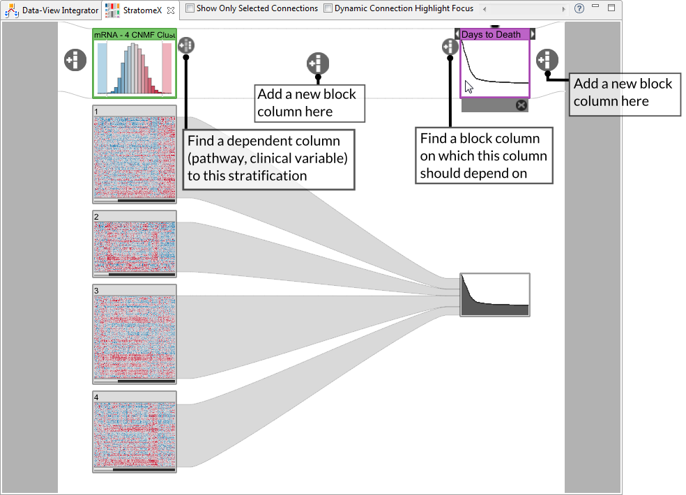
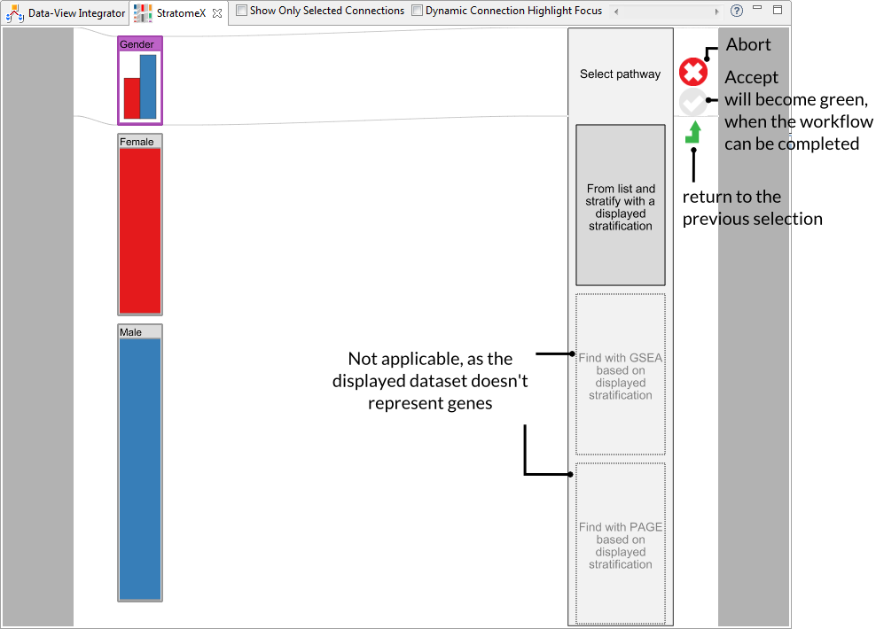

## Query Wizard - Adding Data
The Query Wizard is a simple to use way for finding and adding new blocks to StratomeX. It is an assistive user interface integrated in StratomeX that allows users to choose from various possibilities. In addition to simple browsing, filtering and ranking of possible StratomeX columns (stratifications, pathways, numerical clinical variables) a series of advanced query methods are implemented.

### Query methods
The implemented query methods can be used to find related data set items to the current visible block columns. For this, several basic statistical methods are used to rank a set of dataset items. 

 * **Query based on the similarity to displayed stratifications** 
  This query is useful for finding stratifications that are similar to a currently visible one. The [Adjusted Rand Index](http://en.wikipedia.org/wiki/Rand_index#Adjusted_Rand_index) is used internally to compare two stratifications, while the most similar and the most dissimilar stratifications get the highest score. 

 * **Query based on overlap with displayed cluster** 
  In contrast to the first similarity measure, which quantifies similarities between stratification, this query type aims for finding similar clusters to a selected one based on the [Jaccard Index](http://en.wikipedia.org/wiki/Jaccard_index). While the score for all groups in the searched stratifications are calculated, the best score per stratification will be presented. In addition, if the query is triggered from a binary data domain, mutations for instance, a mutual exclusivity score is computed per group, which can be used to identify genes that have the opposite mutation status for a set of patients.

 * **Query based on log-rank test score (survival)** 
  This query identifies groups of patients that have a significant change in survival compared to the rest of the patients in the same stratification. It uses the [log-rank test](http://en.wikipedia.org/wiki/Logrank_test), where the absolute value is used for scoring the stratifications. Similar to the previous method, the score will be computed for each cluster of a stratification and the best result per stratification is presented to the analyst.

 * **Query for pathways scored by GSEA based on displayed cluster** 
  This query type allows identifying relevant pathways for a given set of patients. It takes a group of patients as input and computes the signal to noise ratio (SNR) between the gene expressions of the samples in that group to the rest of the same stratification. The SNR is finally used to score pathways based on their contained gene sets using [Gene Set Enrichment Analysis (GSEA)](https://www.broadinstitute.org/gsea/index.jsp). Additional meta information like the number of mapped genes are shown to allow further filtering operations like excluding too large pathways or pathways where only a few genes can be mapped to the data.
  
### User Interface
The Query wizard can be triggered at different positions within StratomeX to either add a new column at a specific position, for finding a dependent column like pathways to a column, or for finding an independent column on which an unstratified clinical variable should depend on. The following figures show various different Query wizard trigger places on the left and an intermediate step of the wizard including explanations on the right. 

 
Some workflow paths require that the user selects a cluster or a whole stratification. Valid choices will be highlighted using a light grey border and can be selected by clicking on the corresponding block header. The current selected block will be highlighted with an orange border.