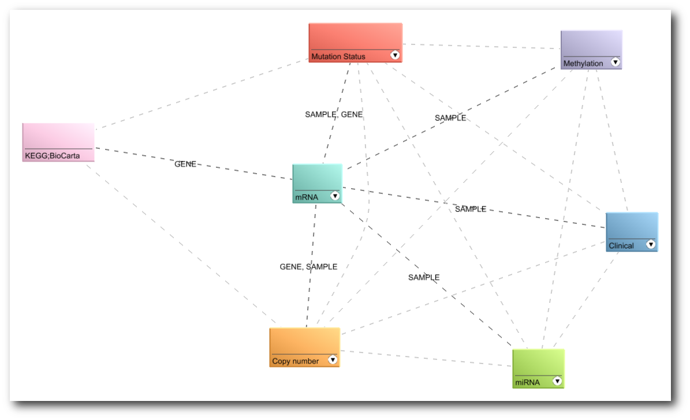
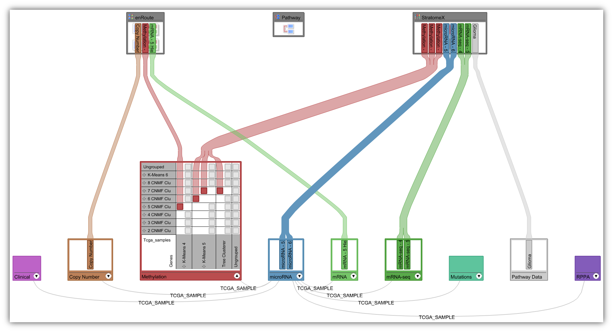
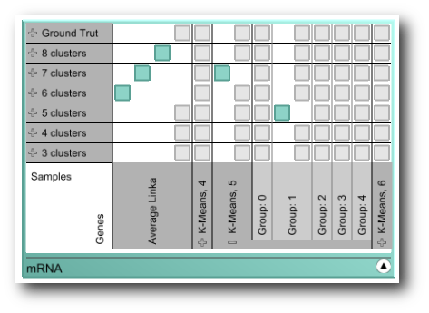

#Caleydo Basics

[Managing Views](#Managing_Views)
[Dataset Info](#Dataset_Info)
[Data-View Integrator](#Data-View_Integrator)
[Table](#Table)
[Search](#Search)
[Selection Info](#Selection_Info)

##Managing Views
Caleydo uses views as interfaces to the user. Nearly everything in Caleydo is a view. You can drag and drop views and place them wherever you like. To open a view use the "View" menu. We distinguish between "Tools", which are basic support views such as the tool-bar, the integrated histogram/color legend and some other informative views and more complex "Visualizations". We discuss the tools in the following, while the visualizations have their own dedicated help page.

##Selection Info
The Selection Info view shows information about the currently selected elements. Whenever you mouse-over or click an element in any of the Caleydo views it is added to the selection info view. Dark-orange shows clicked and light orange shows mouse-hovered elements. It is possible to select multiple items, also multiple items of different types of data. In the example on the right a couple of sample variables and a clinical variable is selected.

You can **clear all selections** by clicking on the "Clear All Selections" button in the toolbar.

##Dataset Info

The DataSet Info view shows you meta-data about the selected dataset. The content of this view is exchanged whenever you click on data from different datasets. The dialog shows you some information on the dataset plus the distribution in a histogram, which also is a legend of the color-coding of the dataset at the same time.

You can **modify the color coding** by dragging the bars at the sides of the histogram.

If you want to use a completely different color-coding you can double-click on the color-legend bar below the histogram, which presents you with the options seen in the lower picture.

##Data-View Integrator
The Data-View Integrator is a graph visualization that represents every loaded dataset as a **data node** and every view that is currently opened in Caleydo as a **view node**. Links are drawn between data nodes, if the IDs of their data can be mapped. Data nodes are connected to view nodes, if their data shown in the views. Using the Data-View Integrator you can

 * **Gain an overview** of all loaded datasets and their relationships.
 * **Create dataset perspectives** - define the data and the way it is grouped.
 * **Assign data to views** in order to be visualized.

### Layout
The Data-View Integrator supports two different node layouts: A **spring-based** and a **bipartite** layout. You can switch between these two layouts by using the tool bar on the top right side of the view.

The spring-based layout places connected nodes closer together, so that this layout is especially suitable for gaining an overview of the datasets and their relationships. When hovering the mouse over a data node the ID types that are shared with other datasets are displayed on the links. Links between data nodes can be hidden by default using the tool bar. You can also position every node individually positioned using drag and drop.

In the bipartite layout view nodes are located at the top of the view, whereas data nodes are arranged at the bottom. This layout is intended to be used when specifying grouping configurations and assigning data to views.

### Creating Dataset Perspectives
A **dataset perspective** defines amongst others for the rows and the columns of a dataset how they are grouped. This is done by specifying a row and a column perspective. For more information about perspectives, refer to [this page](loading.md).

In the default representation of a data node none of the row or column perspectives defined for the dataset are shown. By clicking on the arrow button on the bottom right of a data node, it switches to its **matrix representation**, where each row refers to a row perspective and each column to a column perspective. You can create a dataset perspective that uses a specific row/column perspective combination by simply clicking on the corresponding grey cell of the matrix. You are then prompted to enter a name for the dataset perspective. After confirming the name, the newly created dataset perspective is represented by a colored cell in the matrix, or as a bar in the default representation of a data node.

In the matrix representation you can reveal the individual groups of a perspective by clicking on the "+" icon next it. Creating a dataset perspective for such an individual group actually refers to grouping a subset of the dataset.

A row perspective that has been loaded for one dataset can also be used in another one, if the ID types of their rows can be mapped. In order to do this, drag the row perspective from one data node to another one.

Note, that for categorical data such as mutation status or copy number data from the sample project, a categorization (which is actually a dataset perspective) can be created for single genes in the search view. Just search for a gene and create a categorization for the desired dataset using the context menu. Once created a categorization will be displayed in the associated data node.

### Assigning Data to Views
Data can be assigned to views in two ways:

 * By dragging a dataset perspective of a data node to a view node.
 * By using the context menu of a dataset perspective: Choose "Show in..." and select the desired view, or choose "Add to StratomeX".

##Search
The search view is currently limited to searching genes and pathways. This will change in future releases, where arbitrary IDs can be searched for.

To search for a gene or a pathway map simply type a string into the query box and press search. You can exclude certain ID Types by un-checking them. If your search returned results they are presented to you in a table. The first columns of this table tells you whether this gene is available in the dataset specified in the caption. In the example in the figure on the right, the gene in the first line is available in the mRNA and the copy-number dataset, but not in the mutation status dataset.

If a pathway matches your query, or a pathway contains a selected gene you can directly open it via the context menu.

An important feature of the search dialog is it's ability to **create categorizations based on genes**. This means that a new grouping (and perspective) can be created based on an individual gene. By right-clicking on a row in the search results you get the options to create categorizations for the various datasets. Currently that makes most sense for copy-number and mutation status data. Support for other data types will be added in the future. Clicking, for example, on the "Create categorization of Mutation Status" will result in a perspective being created with two groups: one containing all mutated samples, and another one containing all normal samples.

## Table
Attention: WRITE ME
