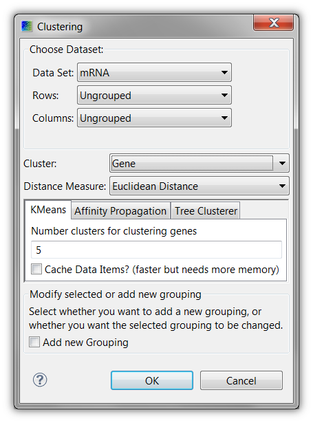

#Caleydo Basics

##Managing Views
Caleydo uses views as interfaces to the user. Nearly everything in Caleydo is a view. You can drag and drop views and place them wherever you like. To open a view use the "View" menu. We distinguish between "Tools", which are basic support views such as the tool-bar, the integrated histogram/color legend and some other informative views and more complex "Visualizations". We discuss the tools in the following, while the visualizations have their own dedicated help page.

##File Operations
Using the "File" dialog or the equivalent buttons in the tool bar you can save Caleydo projects, import, and export data.

A **Caleydo Project** is a .cal file that contains all information about a session, including the loaded datasets, created or loaded groupings as well as which views are open and what data they show. Project files are a convenient way to store an analysis session and restore it later.

Pressing **Import Data** will bring you to the data import process you might have encountered upon startup (see [Loading Data](loading.md)). This allows you to add multiple datasets at the same time to Caleydo.

The **Export Data** button opens a dialog that allows you to save a perspective of a dataset (see dataset principles) to a file. This can be useful if you filtered or clustered your data in a particular way and want to process it further using other tools.

##Clustering
Clustering creates a grouping of a perspective. To run a clustering algorithm you have to specify an input dataset, a perspective for the row and a perspective for the columns (see dataset principles). If those are specified you will be presented with a dialog similar to the one on the right.

Caleydo can cluster either the columns or the rows of a perspective.

Two different distance measures are available:

 * the Euclidean distance and
 * the Pearson correlation
 
You also have to choose whether you want to replace the grouping in the input perspective, or whether you want to create a new perspective with a new grouping. The latter adds an additional perspective to the dataset.

Caleydo currently supports three clustering algorithms, two of them are partitional algorithms (where no relation between the separate cluster is known) and one is a hierarchical algorithm (which builds a complete tree of relations). These algorithms are:

The clustering algorithm by Eisen et al (hierarchical). Here you can choose between several linkage options.
Affinity propagation (partitional). This algorithm generally delivers the best results, but can be slow. Affinity propagation lets you choose a factor which influences the number of clusters returned, which may be between 1 and 10, where 1 produces fewer clusters and 10 produces more clusters.
k-means clustering, as implemented by WEKA (partitional). k-means is generally the fastest clustering algorithm, however you must specify the number of clusters yourself.

##Search
The search view is currently limited to searching genes and pathways. This will change in future releases, where arbitrary IDs can be searched for.

To search for a gene or a pathway map simply type a string into the query box and press search. You can exclude certain ID Types by un-checking them. If your search returned results they are presented to you in a table. The first columns of this table tells you whether this gene is available in the dataset specified in the caption. In the example in the figure on the right, the gene in the first line is available in the mRNA and the copy-number dataset, but not in the mutation status dataset.

If a pathway matches your query, or a pathway contains a selected gene you can directly open it via the context menu.

An important feature of the search dialog is it's ability to **create categorizations based on genes**. This means that a new grouping (and perspective) can be created based on an individual gene. By right-clicking on a row in the search results you get the options to create categorizations for the various datasets. Currently that makes most sense for copy-number and mutation status data. Support for other data types will be added in the future. Clicking, for example, on the "Create categorization of Mutation Status" will result in a perspective being created with two groups: one containing all mutated samples, and another one containing all normal samples.

##Selection Info
The Selection Info view shows information about the currently selected elements. Whenever you mouse-over or click an element in any of the Caleydo views it is added to the selection info view. Dark-orange shows clicked and light orange shows mouse-hovered elements. It is possible to select multiple items, also multiple items of different types of data. In the example on the right a couple of sample variables and a clinical variable is selected.

You can **clear all selections** by clicking on the "Clear All Selections" button in the toolbar.

##Dataset Info

The DataSet Info view shows you meta-data about the selected dataset. The content of this view is exchanged whenever you click on data from different datasets. The dialog shows you some information on the dataset plus the distribution in a histogram, which also is a legend of the color-coding of the dataset at the same time.

You can **modify the color coding** by dragging the bars at the sides of the histogram.

If you want to use a completely different color-coding you can double-click on the color-legend bar below the histogram, which presents you with the options seen in the lower picture.
