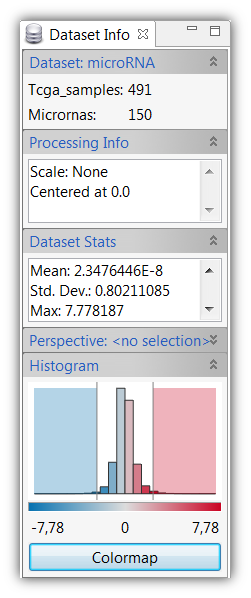
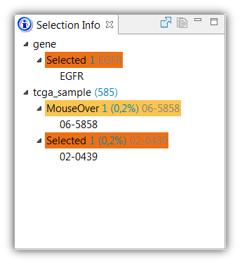

# Caleydo Basics

[Managing Views](#Managing_Views)
[Data-View Integrator](#Data-View_Integrator)
[Dataset Info](#Dataset_Info)
[Selection Info](#Selection_Info)
[Search](#Search)
[Table](#Table)
[Parallel Coordinates](#Parallel_Coordinates)

## Managing Views
Caleydo uses views as interfaces to the user. Nearly everything in Caleydo is a view. You can drag and drop views and place them wherever you like. To open a view use the "View" menu. We distinguish between "Tools", which are basic support views such as the tool-bar, the integrated histogram/color legend and some other informative views and more complex "Visualizations". We discuss the tools in the following, while the visualizations have their own dedicated help page.

## Dataset Info
The DataSet Info view shows you meta-data about the selected dataset. The content of this view is exchanged whenever you click on data from different datasets. The view consists of several parts, showing general information about the dataset such as the number of rows and columns, information about processing applied to data like scaling, dataset stats including mean value and standard deviation, and, if you have selected a perspective of the dataset, information about this perspective. This view also shows the data distribution in a histogram, which also is a legend of the color-coding of the dataset at the same time.

You can **modify the color coding** by dragging the bars at the sides of the histogram.

If you want to use a completely different color-coding you can click on the Colormap button below the histogram, which presents you with different options for color coding your data.

## Selection Info
The Selection Info view shows information about the currently selected elements. Whenever you mouse-over or click an element in any of the Caleydo views it is added to the selection info view. Dark-orange shows clicked and light orange shows mouse-hovered elements. It is possible to select multiple items, also multiple items of different types of data. In the shown example one gene and one sample has been clicked, and also one additional sample has been mouse-overed. You can also copy the identifiers of selections to the clipboard using the button in the selection info's toolbar. If a gene has been selected, you can search for this gene in [GeneCards](http://www.genecards.org/) by clicking on the corresponding button in the toolbar.

You can **clear all selections** by clicking on the "Clear All Selections" button in the general toolbar.

## Search
In the search view you can search for any ids in all loaded datasets.

To search for an id, simply type a string into the query box and press search. You can exclude certain identifiers by un-checking them. If your search returned results they are presented to you in a table. The first columns of this table tell you whether the id was found in the dataset specified in the caption. In shown figure the gene of the first row is available in all datasets but RPPA.

An important feature of the search view is it's ability to **create categorizations based on genes**. This means that a new grouping (and perspective) can be created based on an individual gene. By right-clicking on a row in the search results that corresponds to a gene, you get the options to create categorizations for the various datasets. Currently that makes most sense for copy-number and mutation status data. Clicking, for example, on the "Create categorization within Mutations" will result in a perspective being created with two groups: one containing all mutated samples, and another one containing all normal samples.

