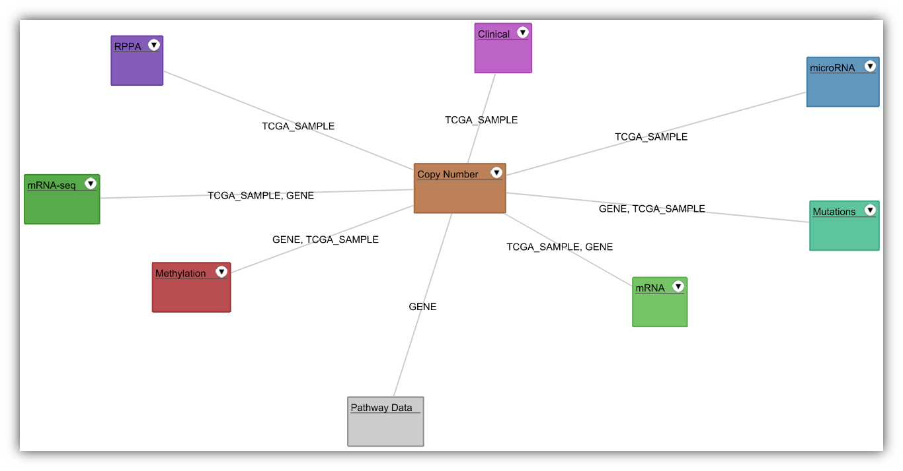
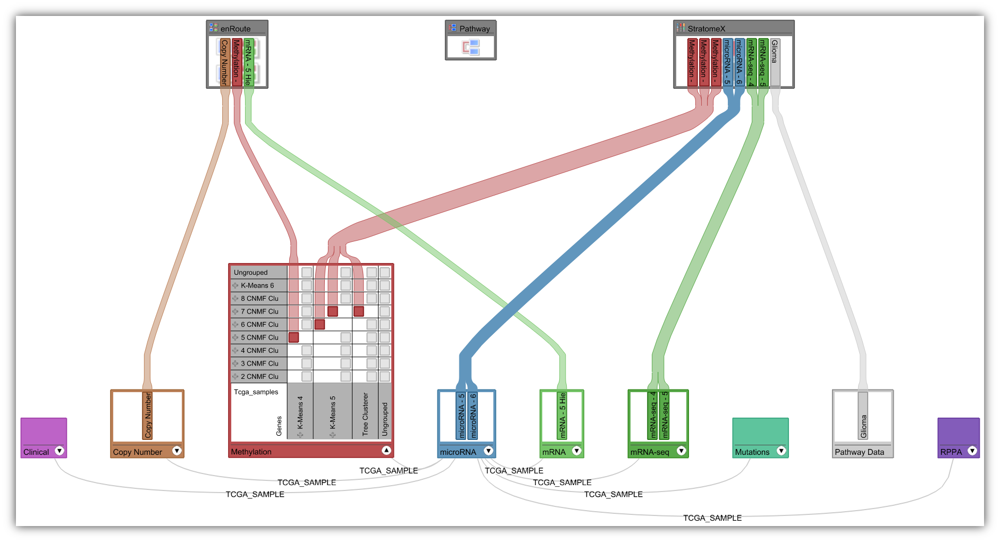
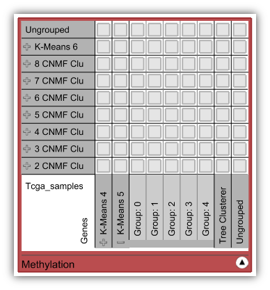

## Data-View Integrator
The Data-View Integrator is a graph representation that displays every loaded dataset as a **data node** and every view that is currently opened in Caleydo as a **view node**. Links are drawn between data nodes, if the IDs of their data can be mapped. Data nodes are connected to view nodes, if their data is shown in the views. Using the Data-View Integrator you can

 * **Gain an overview** of all loaded datasets and their relationships.
 * **Assign data to views** in order to be visualized.

### Layout
The Data-View Integrator supports two different node layouts: A **spring-based** and a **bipartite** layout. You can switch between these two layouts by using the tool bar on the top right side of the view.

The **spring-based layout** places connected nodes closer together, so that this layout is especially suitable for gaining an overview of the datasets and their relationships. When hovering the mouse over a data node the ID types that are shared with other datasets are displayed on the links. Links between data nodes can be hidden by default using the tool bar. You can also position every node individually using drag and drop.

In the **bipartite layout** view nodes are located at the top of the view, whereas data nodes are arranged at the bottom. This layout is intended to be used when assigning data to views.

### Data Organization
We use **dataset perspectives** to define sets of rows and columns and their groupings of a tabular dataset. This is done by specifying a row and a column perspective. For more information about perspectives, refer to [this page](loading.md).

In the default representation of a data node none of the row or column perspectives defined for the dataset are shown. By clicking on the arrow button on the bottom right of a data node, it switches to its **matrix representation**, where each row refers to a row perspective and each column to a column perspective. A dataset perspective corresponds to a specific row/column perspective combination and is represented by a cell of the matrix. You can reveal the individual groups of a row- or column perspective by clicking on the "+" icon next it. 

A row- or column perspective that has been loaded for one dataset can also be used in another one, if the ID types of their rows can be mapped. In order to do this, drag the row perspective from one data node to another one.

Note, that for categorical data such as mutation status or copy number data from the sample project, a categorization (which is actually a dataset perspective) can be created for single genes in the search view. Just search for a gene and create a categorization for the desired dataset using the context menu. Once created a categorization will be displayed in the associated data node.

At any time you can rename row-, column-, or dataset perspectives, individual groups, datasets, and views using the context menu.

### Assigning Data to Views
The Data-View Integrator offers a generic method for adding data to all visualizations within Caleydo. You can assign data to a view by simply dragging a dataset perspective of a data node to a view node. Alternatively, you can also use context menu of a dataset perspective and choose "Show in..." or "Add to..." and select the desired view. The former method opens a new view with the specified dataset perspective, whereas the latter method adds it to an existing view. Note that dataset perspectives, which are currently displayed in a view, are colored and also shown in the default representation of data nodes. 