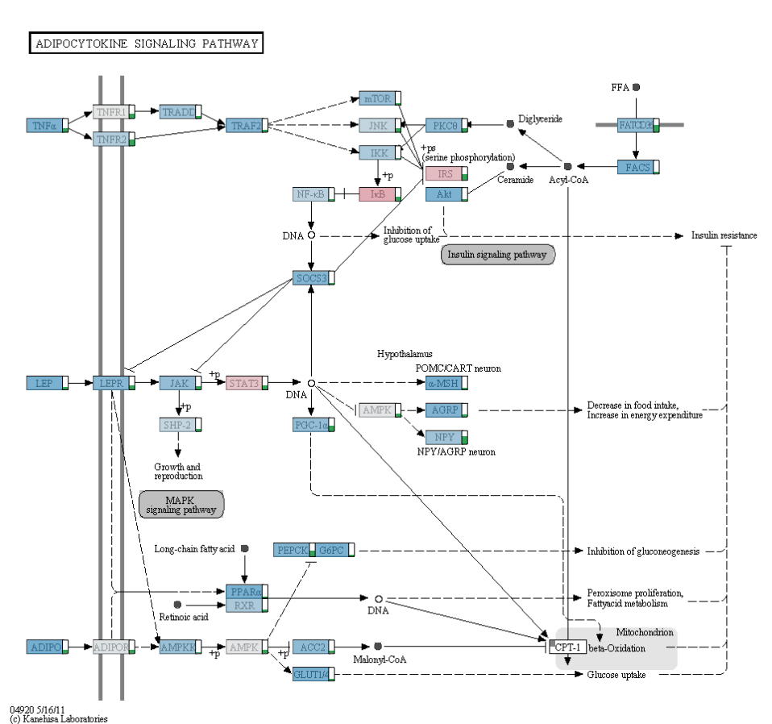
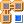
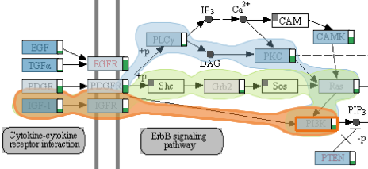

#enRoute
enRoute is a visualization technique for the analysis of multi-dimensional data in the context of pathways. For a general introduction please refer to the [enRoute project page](http://enroute.calyedo.org/). 

##Pathway View
The pathway view allows to explore different KEGG pathway maps. A pathway map can be chosen using the drop-down box of the tool bar.

###On-Node Data Mapping
The nodes of pathway maps can be overlayed with a color code showing the values of related experimental data. By default no overlay is shown, but you can choose to show an overlay for compatible datasets from the dataset drop-down box. Alternatively, you can also assign subsets of these datasets using the [Data-View Integrator](dvi.md). You can either map all samples from the chosen source by clicking the "Map all Samples" radio button, or only samples that are currently selected (shown in the "Selection Info View") by choosing "Map selected Samples".
If more than one sample is mapped at the same time the average value is calculated and a little green bar chart next to the node shows how variable the values for this node are - if the bar is long this indicates high variance, if it's short or absent this indicates low or no variance.

In some cases your dataset might not have a mapping for a gene in the pathway. We indicate the abscence of a mapping by drawing a small rectangle in the upper left corner of the pathway node.

###Path Selection
In order to explore experimental data mapped to pathway nodes in more detail, a path of nodes can be extracted from the pathway view and then be shown side-by side with experimental data in the [enRoute view](enroute.md) discussed in the next chapter.

 
Before a path can be selected, the path selection mode must be enabled by clicking the corresponding button in the toolbar. This mode can be disabled any time by clicking on the button again.

To start a path click the "Toggle Path Selection" button (shown on the left) or press "Ctrl+O". Then selecting a start node and an end node, which selects the shortest path between these nodes. This paths is highlighted with an orange bubble. If alternative paths between the specified nodes exist, they are also indicated by highlighting. Clicking on one of these highlights causes the alternative path to be selected. Note that only those paths of nodes can be selected, which are also present in the pathway.

A selected path can be extended by holding the Shift key and clicking on the node the path should be extended to. Similarly a path can be shortened by holding the Ctrl key and clicking on a node of the selected path.

 
Paths can be cleared using the corresponding button in the tool bar.

##enRoute View
The enRoute view can be used for the exploration of large amounts of experimental data that is associated with a path of pathway nodes. enRoute is essentially divided into two parts: the path visualization and the experimental data visualization.

 
In the enRoute view, every displayed element is granted enough space to be perceived well. If lots of data needs to be displayed, it can happen that horizontal scrolling is required. By selecting the corresponding button in the toolbar, the displayed content is resized to fit the width of the view.

###Path Visualization
 
On the left side of the enRoute view, the path of nodes that has been selected in the Pathway view is displayed in a top-down layout. Branches are indicated as abstract nodes that connect to the path nodes on the left side. They either summarize incoming or outgoing branches.

By clicking on the "+" icon of such a node, the individual branches are revealed by showing the first node of each branch together with an abstract preview of its mapped experimental data. When such a node is selected, all nodes of the corresponding branch up to the next branch or a dead end become part of the selected path. They either replace the existing nodes below or above the node where the branching occurs, depending on whether the selected branch is incoming or outgoing.

The currently selected path can also be modified by removing the nodes at each end. This can be achieved by hovering the mouse over the node and clicking the "x" icon that shows up.

##Experimental Data Visualization
In order to display experimental data in the enRoute view, **dataset perspectives** have to be assigned to enRoute using the [Data-View Integrator](dvi.md).
The experimental data is organized in rows and columns. Each row shows data associated with the node it is connected to. Columns represent groups of experiments, which have been specified by the dataset perspective.

Numerical data, such as gene expression data, is represented as simple bar charts, where each bar refers to one experiment. 

 

For the categorical copy number data a special encoding is used to represent the 5 categories:

 * _Deleted on one allele_: light blue bar pointing downwards
 * _Deleted on both alleles_: dark blue bar pointing downwards
 * _Normal copy number_: no bar
 * _Low amplification_: light red bar pointing upwards
 * _High amplification_: dark red bar pointing upwards

 
 

 
By clicking the button below the caption of each column, the representation of the experimental data can be switched to a more abstract form for that column. For numerical values, a single bar showing the average value of a group is used together with an error bar indicating the standard deviation. For copy number data a histogram is shown as abstract representation.
