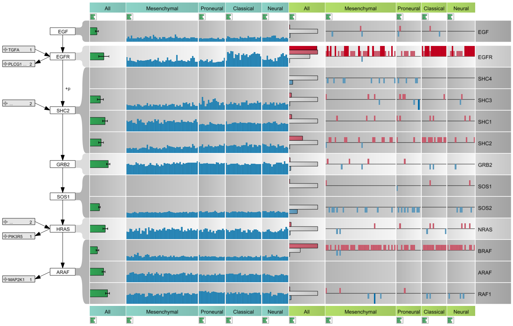
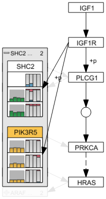
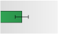
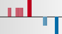
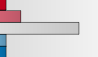

#enRoute
enRoute is a visualization technique for the analysis of multi-dimensional data in the context of pathways. For a general introduction please refer to the [enRoute project page](http://enroute.calyedo.org/). 

The enRoute view can be used for the exploration of large amounts of experimental data that is associated with a path of pathway nodes. enRoute is essentially divided into 2 parts: the path visualization and the experimental data visualization.

 
In the enRoute view, every displayed element is granted enough space to be perceived well. If lots of data needs to be displayed, it can happen that horizontal scrolling is required. By selecting the corresponding button in the toolbar, the displayed content is resized to fit the width of the view.

##Pathway View

##Path Visualization

 
On the left side of the enRoute view, the path of nodes that has been selected in the Pathway view is displayed in a top-down layout. Branches are indicated as abstract nodes that connect to the path nodes on the left side. They either summarize incoming or outgoing branches.

By clicking on the "+" icon of such a node, the individual branches are revealed by showing the first node of each branch together with an abstract preview of its mapped experimental data. When such a node is selected, all nodes of the corresponding branch up to the next branch or a dead end become part of the selected path. They either replace the existing nodes below or above the node where the branching occurs, depending on whether the selected branch is incoming or outgoing.

The currently selected path can also be modified by removing the nodes at each end. This can be achieved by hovering the mouse over the node and clicking the "x" icon that shows up.

##Experimental Data Visualization
In order to display experimental data in the enRoute view, **dataset perspectives** have to be assigned to enRoute using the [Data-View Integrator](dvi.md).
The experimental data is organized in rows and columns. Each row shows data associated with the node it is connected to. Columns represent groups of experiments, which have been specified by the dataset perspective.

 
 
 
 

Numerical data, such as gene expression data, is represented as simple bar charts, where each bar refers to one experiment. For the categorical copy number data a special encoding is used to represent the 5 categories:

 * _Deleted on one allele_: light blue bar pointing downwards
 * _Deleted on both alleles_: dark blue bar pointing downwards
 * _Normal copy number_: no bar
 * _Low amplification_: light red bar pointing upwards
 * _High amplification_: dark red bar pointing upwards

 
By clicking the button below the caption of each column, the representation of the experimental data can be switched to a more abstract form for that column. For numerical values, a single bar showing the average value of a group is used together with an error bar indicating the standard deviation. For copy number data a histogram is shown as abstract representation.
