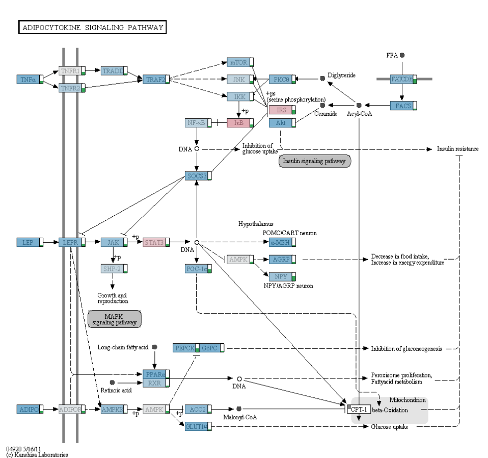
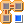
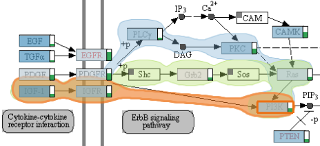

##Pathway View

The pathway view allows to explore different KEGG pathway maps. A pathway map can be chosen using the drop-down box of the tool bar.

###On-Node Data Mapping
The nodes of pathway maps can be overlayed with a color code showing the values of related experimental data. By default no overlay is shown, but you can choose to show an overlay for compatible datasets from the dataset drop-down box. Alternatively, you can also assign subsets of these datasets using the [Data-View Integrator](dvi.md). You can either map all samples from the chosen source by clicking the "Map all Samples" radio button, or only samples that are currently selected (shown in the "Selection Info View") by choosing "Map selected Samples".
If more than one sample is mapped at the same time the average value is calculated and a little green bar chart next to the node shows how variable the values for this node are - if the bar is long this indicates high variance, if it's short or absent this indicates low or no variance.

In some cases your dataset might not have a mapping for a gene in the pathway. We indicate the abscence of a mapping by drawing a small rectangle in the upper left corner of the pathway node.

###Path Selection
In order to explore experimental data mapped to pathway nodes in more detail, a path of nodes can be extracted from the pathway view and then be shown side-by side with experimental data in the [enRoute view](enroute.md) discussed in the next chapter.

 
Before a path can be selected, the path selection mode must be enabled by clicking the corresponding button in the toolbar. This mode can be disabled any time by clicking on the button again.

To start a path click the "Toggle Path Selection" button (shown on the left) or press "Ctrl+O". Then selecting a start node and an end node, which selects the shortest path between these nodes. This paths is highlighted with an orange bubble. If alternative paths between the specified nodes exist, they are also indicated by highlighting. Clicking on one of these highlights causes the alternative path to be selected. Note that only those paths of nodes can be selected, which are also present in the pathway.

A selected path can be extended by holding the Shift key and clicking on the node the path should be extended to. Similarly a path can be shortened by holding the Ctrl key and clicking on a node of the selected path.

 
Paths can be cleared using the corresponding button in the tool bar.
