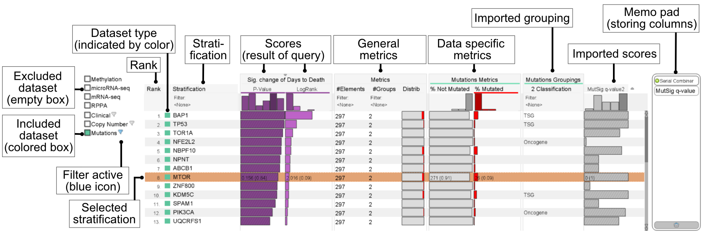

## LineUp
LineUp is visualization technique for analyzing multi-attribute rankings. If you want to find out more about this general visualization technique, take a look at the [LineUp project page](http://lineup.caledydo.org). 

In StratomeX, LineUp is used as a selection interface for block columns. LineUp can be categorized in three parts: 

 * **Dataset selection** 
   The dataset list on the left can be used to include and exclude datasets from the ranking query. In addition, clinical and categorical datasets support simple filtering operations that can be used to filter specific categories and/or specific clinical variable data types. A context menu of the dataset items provides additional features including the loading of external grouping and scores.

 * **Ranking table** 
   The central part of the LineUp visualization technique can be used to rank, filter, browse, and select the contained dataset items in a flexible way.

 * **Memo pad** 
   The area on the right of the LineUp interface can be used to persist scores over multiple wizards instances. Please take a look at the [LineUp project page](http://lineup.caledydo.org) for details about the memo pad.
   
### Ranking table
The ranking table is the central part of LineUp. It consists of multiple columns that can be freely re-ordered using drag-and-drop. Each column provides its own menu, e.g. for filtering and searching data. The following column types are available:

 * **Rank column** showing the rank of the current item.

 * **Stratification column** showing the name and the dataset type indicated by color. The column supports simple filtering and search operations.

 * **Score column** depending on the current query, zero, one or more score query columns are shown in the ranking table for ranking the dataset items.

 * **General metric columns** 
  This group of columns presents simple statistics about an item, including the number of elements, the number of groups, and a simple group distribution visualization

 * **Data type specific metric columns** 
  For each included categorical datasets additional metric columns are displayed showing the distribution of the contained categories. In addition, dimension stratifications are automatically added as categorical grouping columns.

 * **Externally loaded score columns** 
  In addition to automatically created and computed query scores during the Tour Guide process, external scores can be imported to the LineUp interface. The import process can be triggered by using the context menu of a dataset. 

### Interaction
Rows can be selected by clicking on them. LineUp also supports navigation via keyboard using up/down keys and page up/down keys and scrolling by mouse wheel. Sorting by a column can be done by double-clicking its header. The current sort criterion is indicated by a small triangle glyph above the column header. 

*Power feature*: Adding an item to StratomeX without having an open Tour Guide wizard can be done by double-clicking the item.

Attention: If a Tour Guide wizard instance is open, previews will only be shown when the wizard is in the correct state, otherwise the selection will be ignored. 

The current selected row will be highlighted in orange. Grey rows indicate items that are already visible in StratomeX. An orange dashed border will be used within StratomeX and LineUp to indicate the currently previewed item. 

Score queries based on a parameter (e.g. find similar to a displayed stratification) are colored according the dataset color of the selected parameter, allowing simpler association.
