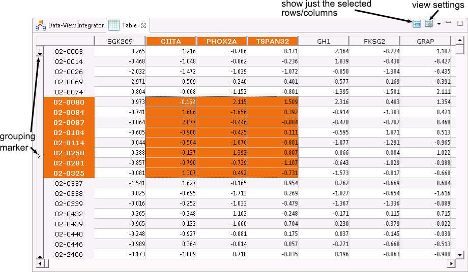

## Table
The table view is a scalable raw data viewer. It can be used to display arbitrary table perspectives.

It supports:

* record / dimension groupings 
  if the selected table perspectives contains record or dimension stratifications the table viewer groups the corresponding rows / columns together, similar MS Excel grouping feature.

* scalable data mode 
  The viewer internally uses [Nattable](http://www.eclipse.org/nattable/) for rendering. 

* different data representations  
  besides the raw data the normalized data can be shown with the viewer

* selection 
  the viewer cell selection is synchronized with the global selection mechanism, such that selections from other views are highlighted in the viewer and vice versa.

* selection only 
  in this mode only the currently selected rows and columns are shown in the data viewer.

* variable formatter 
  you can change the number of decimal places via the view menu.